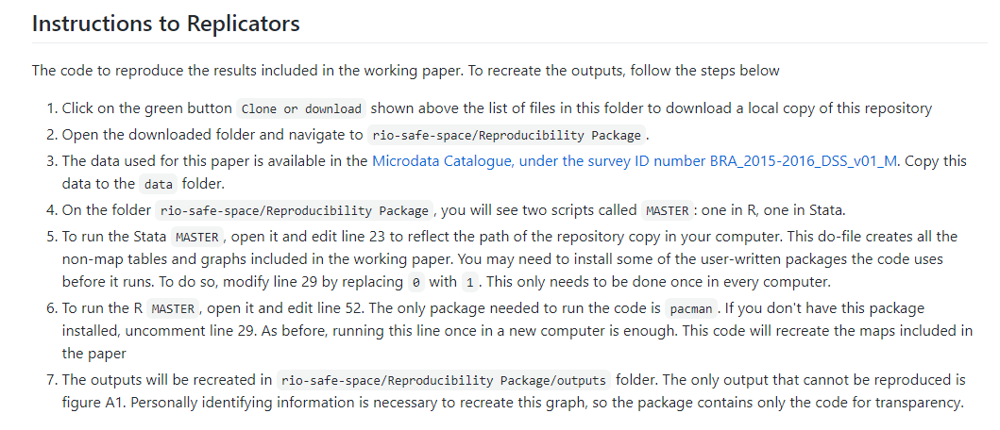

# Conducting reproducible, transparent, and credible research {#reproducibility}

Policy decisions are made every day using the results of development research,
and these have wide-reaching effects on the lives of millions.
As the emphasis on evidence-based policy grows,
so too does the scrutiny under which research methods and results are placed.
Three major components make up this scrutiny:
credibility, transparency, and reproducibility.
These three components contribute to one simple idea:
research should be high quality and well-documented.
Research consumers, including the policy makers who will use the evidence to make decisions,
should be able to easily examine and recreate such evidence.
In this framework, it is useful to think of research as a public service
that requires researchers as a group to be accountable for their methods.
This means acting to collectively protect the credibility of development research
by following modern practices for research planning and documentation.
Across the social sciences, the open science movement has been fueled
by concerns about the proliferation of low-quality research practices,
data and code that are inaccessible to the public,
analytical errors in major research papers,
and in some cases even outright fraud.
While the development research community has not yet
experienced major scandals,
it has become clear that there are necessary improvements to make
in the way that code and data are handled as part of research.
Moreover, having common standards and practices
for creating and sharing materials, code, and data with others
will improve the value of the work we do.

In this chapter, we outline principles and practices that help to ensure
research consumers can be confident in the conclusions reached.
We discuss each of the three components --
credibility, transparency, and reproducibility -- in turn.
The first section covers research credibility.
It presents three popular methods to commit to particular research questions or methods,
and avoid potential criticisms of cherry-picking results:
registration, pre-analysis plans, and registered reports.
The second section discusses how to apply principles of transparency to all research processes,
which allows research teams to be more efficient, and
research consumers to fully understand and evaluate research quality.
The final section provides guidance on how to make your research fully reproducible,
and explains why publishing replication materials is an important research contribution in its own right.

```{block2, type = "summary", class.source = 'fold-hide'}
### Summary: Conducting reproducible, transparent, and credible research {-}

This chapter describes three pillars of a high-quality empirical research project: credibility, transparency and reproducibility. These steps and outputs discussed in this chapter should be prepared at the beginning of a project and revisited through the publication process.

**1.	Credibility:** to enhance credibility, you should pre-commit research decisions as much as feasible
  
-	*Register* research studies to provide a record of every project, so all evidence about a topic can be maintained; *pre-register* studies to protect design choices from later criticism.
-	Write *pre-analysis plans* to both strengthen the conclusions drawn from those analyses and increase efficiency by creating a road map for project data work.
-	Publish a *registered report* to combine the benefits of the two steps above with a formal peer review process and a conditional acceptance of the final results of the specified research.

**2.	Transparency:** you should document all data acquisition and analysis decisions during the project lifecycle, with a clear understanding of what will be released publicly and plan for how those will be published
  
-	Develop and publish comprehensive *project documentation*, especially instruments for data collection or acquisition that may be needed to prove ownership rights and facilitate re-use of the data.
-	Retain all *original data* in an unaltered form and archive it appropriately, in preparation for it to be de-identified and published at the appropriate time.
- Write all data processing and analysis *code* with public release in mind.

**3.	Reproducibility:** Prepare analytical work that can be verified and reproduced by others. This means
  
-	Understanding what *archives and repositories* are appropriate for your various materials
-	Preparing for *legal documentation and licensing* of data, code, and research products
-	Initiating *reproducible workflows* that will easily transfer within and outside of your research team and the necessary documentation for others to understand and use your materials

#### Takeaways {-}

**TTLs/PIs will:**
  
-	Develop and document the research design and the corresponding data required to execute it
-	Guide the research team in structuring and completing project registration
-	Understand the team’s future rights and responsibilities regarding data, code, and research publication
-	Determine what methods of pre-commitment are appropriate and lead the team in preparing them

**RAs will:**
  
-	Rework outputs and documentation to meet specific technical requirements of registries, funders, publishers, or other governing bodies
-	Inform the team leadership whenever methodologies, data strategies, or their planned executions are not sufficiently clear or are not appropriately documented or communicated
-	Familiarize themselves with best practices for carrying out reproducible and transparent research, and initiate those practices within the research team
 
#### Key Resources {-}
  
-	Register your research study: https://dimewiki.worldbank.org/Study_Registration
-	Create a pre-analysis plan: https://dimewiki.worldbank.org/Pre-Analysis_Plan 
-	Prepare to document research decisions: https://dimewiki.worldbank.org/Data_Documentation 
-	Publish data in a trusted repository: https://dimewiki.worldbank.org/Publishing_Data 
-	Prepare and publish a reproducibility package: https://dimewiki.worldbank.org/Reproducible_Research 

```

## Developing a credible research project {-}

<!-- Why development researchers should care about transparency -->
The evidentiary value of research is traditionally a function of design choices,^[
	@angrist2010credibility, @ioannidis2005most]
such as powered through sampling and randomization,
and robustness to alternative specifications and definitions.
One frequent target for critics of such research^[@ioannidis2017power]
is the fact that most researchers have a lot of leeway
in selecting their projects, results, or outcomes
*after* already having had the experience of implementing a project
or collecting data in the field,
which increases the likelihood of finding "false positive"
results that are not true outside carefully-selected data.^[@simmons2011false]
Credible research design methods are key to maintaining credibility
in these choices and avoiding serious errors.
This is especially relevant for research that relies on original data sources,
from innovative big data sources to unique surveys.
Development researchers should take these concerns seriously.
Such flexibility can be a significant issue for the quality of evidence overall,
particularly if researchers believe that certain types of results
are substantially better for their careers or their publication chances.

This section presents three popular methods
for researchers to commit to particular research questions or methods,
and to avoid potential criticisms of cherry-picking results for publication:
registration, pre-analysis plans, and registered reports.\index{registration}\index{pre-analysis plans}\index{registered reports}
Each of these methods involves documenting specific research design components,
ideally before carrying out the analytical component or extensively exploring the data.
Study registration provides formal notice that a study is being attempted
and creates a hub for materials and updates about the study results.
Pre-analysis plans are a more formal commitment
to use specific methods on particular questions.
Writing and releasing a pre-analysis plan
in advance of working with data is used to protect the credibility
of approaches that have a high likelihood of producing false results.^[@wicherts2016degrees]
Finally, registered reports allow researchers to approach research planning itself
as a process at the level of a full peer review.
Registered reports enable close scrutiny of a research design,
a feedback and improvement process,
and a commitment from a publisher to publish the study
based on the credibility of the design, rather than the specific results.

### Registering research studies {-}

<!-- Pre-registration -->
Registration of research studies is an increasingly common practice,
and more journals are beginning to require
the registration of studies they publish.^[@vilhuber2020report]
Study registration intended to ensure that a complete record of research inquiry is easily available.^[
	More details on study registrations and 
	links to additional resources can be found on the DIME Wiki:
	https://dimewiki.worldbank.org/Study_Registration]
Registering research studies ensures that future scholars can quickly
find out what work has been carried out on a given question,
even if some or all of the work done never results in formal publication.
Registration of studies is increasingly required by publishers
and can be done before, during, or after the study
with essential information about the study purpose.
Some currently popular registries are operated by the
**AEA**,^[
  https://www.socialscienceregistry.org
] 
**3ie**,^[
  https://ridie.3ieimpact.org
] 
**eGAP**,^[
  https://egap.org/content/registration
] 
and **OSF**^[
  https://osf.io/registries
].
They all have different target audiences and features,
so select one that is appropriate to your work.
Study registration should be feasible for all projects,
as registries are typically free to access and can be initially submitted with minimal information about the project.
A generally-acceptable practice will be to gradually revise and expand the level of detail in a registration over time,
adding more information as the planning for the project progresses.
\index{pre-registration}

Pre-registering studies before they begin is an extension of this principle.^[@nosek2018preregistration]
Registration of a study before it goes to implementation or data acquisition,
particularly when specific hypotheses are included in the registration,
provides a simple and low-effort way for researchers
to conclusively demonstrate that a particular line of inquiry
was not generated by the process of data collection or analysis itself.^[
  More details on how to pre-register your study
	and links to other resources can be found on the DIME Wiki:
	https://dimewiki.worldbank.org/Pre-Registration]\index{pre-registration}
Pre-registrations need not provide exhaustive details about how
a particular hypothesis will be approached; only that it will be.
Pre-registering specific individual elements of research design or analysis 
can be highly valuable for the credibility of the research
and requires only minor time investment or administrative effort.
For this reason, the DIME team requires pre-registration of all studies
in a public database with at least some primary hypotheses prespecified,
prior to providing funding for impact evaluation research.

```{block2, type = 'ex'}
### Demand for Safe Spaces Case Study: Registering Research Studies

The experimental component of the *Demand for Safe Spaces* study was registered at the Registry for International Development Impact Evaluations (RIDIE) under ID 5a125fecae423.

Highlights from the Registry:
  
- *Indicated evaluation method:* both primary method (randomized control trial) and additional methods (difference-in-difference/fixed effects). 
- *Listed key outcome variables:* take-up of rides in women-only car (binary), occurrence of harassment or crime during ride (binary), self-reported well-being after each ride, overall subjective well-being, Implicit Association Test D-Score.
- *Specified primary hypotheses to be tested:* The women-only car reduces harassment experienced by women who ride it; Riding the women’s-only car improves psychological well-being of those who ride it; Women are willing to forego income to ride the women’s-only car.
- *Specified secondary research question and methods:* supplementary research methods (implicit association test and platform survey) to help address an additional hypothesis: The women’s-only car is associated with a social norm that assigns responsibility to women for avoiding harassment.
- *Provided sample size for each study arm:* number of individual participants, number of baseline rides, number of rides during price experiment, number of car-assigned rides, number of expected participants in implicit association test.
- *Described data sources:* the study relied on data previously collected (through the mobile app) and data to-be-collected (through platform surveys and implicit association tests).
- *Registration status:* categorized as a non-prospective registry, as the crowdsourced data had already been received and processed. It was important to the team to ensure the credibility of additional data collection and secondary research questions by registering the study. 

> The RIDIE registry can be accessed at https://ridie.3ieimpact.org/index.php?r=search/detailView&id=588 

```

### Writing pre-analysis plans {-}

<!-- Pre-analysis plans -->
If a research team has a large amount of flexibility
to define how they approach a particular hypothesis,
study registration may not be sufficient to avoid the criticism of
"hypothesizing after the results are known", or HARKing.^[@kerr1998harking]
Examples of such flexibility include a broad range
of concrete measures that could be argued to measure to an abstract concept;
future choices about sample inclusion or exclusion;
or decisions about how to construct derived indicators.
There are a variety of templates and checklists of details to include.^[
We recommend this checklist: 
  https://blogs.worldbank.org/impactevaluations/a-pre-analysis-plan-checklist]
When the researcher is collecting a large amount of information
and has leverage over even a moderate number of these options,
it is almost guaranteed that they can come up with any result they like.^[@gelman2013garden]

Pre-analysis plans (PAPs) can be used to assuage these concerns
by specifying some set of analyses the researchers intend to conduct.^[
  More details on how to prepare a pre-analysis plans
	and links to additional resources
	can be found on the DIME Wiki:
	https://dimewiki.worldbank.org/Pre-Analysis_Plan]\index{pre-analysis plan}
The pre-analysis plan should be written up in detail
for areas that are known to provide a large amount of leeway
for researchers to make later decisions,
particularly for things like interaction effects or subgroup analysis.^[
  See @cusolito2018can for an example.]
Pre-analysis plans shoud not, however, be viewed as binding the researcher's hands.^[@olken2015promises]
Depending on what is known about the study at the time of writing,
pre-analysis plans can vary widely in the amount of detail they should include.^[
  https://blogs.worldbank.org/impactevaluations/pre-analysis-plans-and-registered-reports-what-new-opinion-piece-does-and-doesnt]
The core function of a PAP is to carefully and explicitly describe
one or more specific data-driven inquiries,
as specific formulations are often very hard to justify in retrospect
with data or projects that potentially provide many avenues to approach
a single theoretical question.^[
  See @bedoya2019no for an example.]
Anything outside the original plan is just as interesting and valuable
as it would have been if the plan was never published;
but having pre-committed to the details of a particular inquiry makes its results
immune to a wide range of criticisms of specification searching or multiple testing.^[@duflo2020praise]

```{block2, type = 'ex'}
### Demand for Safe Spaces Case Study: Writing Pre-Analysis Plans

Although the *Demand for Safe Spaces* study did not publish a formal pre-analysis plan, the team published a concept note in 2015, which includes much of the same information as a typical pre-analysis plan. The Concept Note was updated in May 2017 to include new secondary research questions. The Concept Note, prepared before fieldwork began, was subject to review and approval within the World Bank and from a technical committee including blinded feedback from external academics. The Concept Note specified the planned study along the following dimensions: 

- *Theory of change:* the main elements of the intervention, and the hypothesized causal chain from inputs, through activities and outputs, to outcomes. 
- *Hypotheses* derived from the theory of change 
- *Main evaluation question(s)* to be addressed by the study
- *List of main outcomes of interest,* including outcome name, definition, level of measurement
- *Evaluation design,* including a precise description of the identification strategy for each research questions and description of treatment and control groups
- *Sampling strategy and sample size calculation,* detailing the assumptions made
- *Description of all quantitative data collection instruments*
- *Data processing and analysis:* the statistical methods to be used, the exact specification(s) to be run, including clustering of standard errors; key groups for heterogeneity analysis; adjustments for multiple hypothesis testing; strategy to test (and correct) for bias.

> A version of the study’s Concept Note is available at https://github.com/worldbank/rio-safe-space/blob/master/Online%20Appendices/Supplemental%20Material/Project%20Concept%20Note.pdf 

```

### Publishing registered reports {-}

<!-- Registered reports -->
**Registered reports** take the process of pre-specifying a complex research design
to the level of a formal publication.^[
  More details on registered reports and 
  links to additional resources can be found on the DIME Wiki:
  https://dimewiki.worldbank.org/Registered_Reports]\index{registered reports}
In a registered report, a journal or other publisher
will peer review and conditionally accept a specific study for publication,
typically then guaranteeing the acceptance of a later publication
that carries out the analysis described in the registered report.
While far stricter and more complex to carry out than
ordinary study registration or pre-analysis planning,
the registered report has the added benefit
of peer review and expert feedback
on the design and structure of the proposed study.^[
  https://blogs.worldbank.org/impactevaluations/registered-reports-piloting-pre-results-review-process-journal-development-economics]
Registered reports are never required,
but they are designed to reward researchers
who are able to provide a large amount of advance detail for their projects,
researchers who want to secure publication interest regardless of results,
or researchers who want to use methods that may be novel or unusual.

This process is in part meant to combat the "file-drawer problem"^[@simonsohn2014p]\index{file-drawer problem}
and ensure that researchers are transparent in the sense that
all promised results obtained from registered-report studies are actually published.
This approach has the advantage of pre-specifying in great detail
a complete research and analytical design,
and securing a commitment for publication regardless of the outcome.
This may be of special interest for researchers
studying events or programs where either there is a substantial risk
that they would either not be able to publish a null or negative result,^[
  See @coville2019nollywood for an example.]\index{null result}
or where they may wish to avoid any pressure toward finding a particular result,
for example when the program or event is the subject of substantial social or political pressures.
As with pre-registration and pre-analysis,
nothing in a registered report should be understood
to prevent a researcher from pursuing additional avenues of inquiry
once the study is complete, either in the same or separate research outputs.

## Conducting research transparently {-}

Transparent research exposes not only the code,
but all research processes involved in developing the analytical approach.
This means that readers are able to judge for themselves whether the research was done well
and the decision-making process was sound.
If the research is well-structured, and all of the relevant documentation^[
	More details on research documentation and 
	links to additional resources can be found on the DIME Wiki:
	https://dimewiki.worldbank.org/Research_Documentation]\index{research documentation}
is shared, it is easy for the reader to understand the analysis fully.
Researchers that expect process transparency also have an incentive to make better decisions,
be skeptical and thorough about their assumptions,
and save themselves time,
because transparent research methods are labor-saving over the complete course of a project.

Clearly documenting research work is necessary
to allow others to evaluate exactly what data was acquired and how it was used
to obtain a particular result.
Many development research projects are purpose-built
to address specific questions,
and often use unique data, novel methods, or small samples.
These approaches can yield new insights into essential academic questions,
but need to be transparently documented so they can be reviewed
or replicated by others in the future.^[@duvendack2017meant]
Unlike disciplines where data is more standardized
or where research is more oriented around secondary data,
 the exact data used in a development project
has often not been observed by anyone else in the past
and may not be able to be re-collected by others in the future.
Regardless of the novelty of study data,
transparent documentation methods help ensure
that data was collected and handled appropriately
and that studies and interventions were implemented correctly.
As with study registrations, project and data documentation
should be released on external **archival repositories**^[
  **Archival repository:** A third-party service for information storage
  that guarantees the permanent availability of current and prior versions of materials.]\index{archival repository}
so they can always be accessed and verified.


### Documenting data acquisition and analysis {-}

<!-- Documenting a project carefully makes it more transparent -->
Documenting a project in detail greatly increases transparency.
Many disciplines have a tradition of keeping a "lab notebook",
and adapting and expanding this process to create a
lab-style workflow in the development field is a
critical step towards more transparent practices.
This means explicitly noting decisions as they are made,
and explaining the process behind the decision-making.
Careful documentation will also save the research team a lot of time during a project,
as it prevents you from having the same discussion twice (or more!),
since you have a record of why something was done in a particular way.
There are a number of available tools
that will contribute to producing documentation,\index{project documentation}
but project documentation should always be an active and ongoing process,
not a one-time requirement or retrospective task.
New decisions are always being made as the plan begins contact with reality,
and there is nothing wrong with sensible adaptation so long as it is recorded and disclosed.

<!-- Tools for transparency: GitHub, OSF -->
Email, however, is *not* a documentation service, because communications are rarely well-ordered,\index{email}
can be easily deleted, and are not available for future team members.
At the very least, emails and other decision-making communications
need to be archived and preserved (as, say, PDFs)
in an organized manner so that they can be easily accessed and read by others in the future.
There are also various software solutions for building proper documentation over time.
Some work better for field records such as implementation decisions,
research design, and survey development;
others work better for recording data work and code development.
The **Open Science Framework**^[https://osf.io] provides one such solution,\index{Open Science Framework}
with integrated file storage, version histories, and collaborative wiki pages.
**GitHub**^[https://github.com] provides a transparent documentation system
through commit messages, issues, `README` files, and pull requests,^[
  More details on how to use Git and GitHub and links to all DIME Analytics
	resources on best practices and how to get started can be found on the DIME Wiki:
	https://dimewiki.worldbank.org/Getting_started_with_GitHub]\index{task management}\index{GitHub}\index{README}
in addition to version histories and wiki pages.\index{version control}
Such services offer multiple different ways
to record the decision process leading to changes and additions,
track and register discussions, and manage tasks.
These are flexible tools that can be adapted to different team and project dynamics.
Services that log your research process can show things like modifications made in response to referee comments,
by having tagged version histories at each major revision.
They also allow you to use issue trackers
to document the research paths and questions you may have tried to answer
as a resource to others who have similar questions.
Each project has specific requirements for data, code, and documentation management,
and the exact transparency tools to use will depend on the team's needs,
but they should be agreed upon prior to project launch.
This way, you can start building a project's documentation as soon as you start making decisions.


### Cataloging and archiving data {-}

<!-- Documenting survey instrument and survey code -->
Data and data collection methods should be fully cataloged, archived, and documented,
whether you are collecting data yourself or receiving it from an outside partner.
In some cases this is as simple as uploading
a survey instrument or an index of datasets and a codebook to an archive.\index{codebook}
In other cases this will be more complex.
Proper documentation of data collection will often require
a detailed description of the overall sampling procedure.^[
  See @yishay2016gender for an example.]
For example, settings with many overlapping strata,
treatment arms, excluded observations, or resampling protocols
might require extensive additional field work documentation.
This documentation should be continuously updated
and kept with the other study materials;
it is often necessary to collate these materials
for an appendix for publication in any case.

<!-- Preparing an initial catalog and release of data -->
When data is received from partners or collected in the field,
the **original data** (including corrections)^[
  **Original data:** A new dataset, as obtained and corrected,
  that becomes the functional basis for research work.]\index{original data}
should be immediately placed in a secure permanent storage system.
Before analytical work begins, you should create a "for-publication"
copy of the acquired dataset by removing potentially identifying information.\index{de-identification}
This will become the original data, and must be
placed in an archival repository where it can be cited.^[@vilhuber2020report]\index{data publication}
This can initially be done under embargo or with limited release,
in order to protect your data and future work.
This type of data depositing or archiving
precedes publishing or releasing any data:
data at this stage may still need to be embargoed
or have other, potentially permanent, access restrictions,
so you can instruct the archive to formally release the data later.
If your planned analysis requires the use of unpublishable data,
that data should always remain encrypted and be stored separately
so it is clear what portions of the code will work with and without
obtaining a license to the needed restricted-access data.

Some project funders
provide specific repositories in which they require the deposit of data they funded,^[
  For example, https://data.usaid.gov]
and you should take advantage of these when possible.
If this is not provided, you must be aware of privacy issues
with directly identifying data and questions of data ownership
before uploading original data to any third-party server, whether public or not;\index{data ownership}
this is a legal question for your home organization.
If data that is required for analysis must be placed under restricted use or restricted access,
including data that can never be distributed directly by you to third parties,
develop a plan for storing that data separately from publishable information.
This will allow you to maximize transparency by having a clear release package
as well as providing instructions or developing a protocol for allowing access in the future
for replicators or reviewers under appropriate access agreements.^[
  Details on how to document this type of material can be found at
  https://doi.org/10.5281/zenodo.4319999.]
Regardless of these consideration, all data repositories,
such as DIME's standard, the World Bank Microdata Library^[
  https://microdata.worldbank.org]
and the World Bank Data Catalog,^[
  https:/datacatalog.worldbank.org]
should create a record of the data's existence
and provide instructions on how access might be obtained by another researcher.
For more on the steps required to prepare and publish a de-identified dataset,
you can refer to chapters \@ref(analysis) and \@ref(publication) of this book.
Data publication should create a data citation and a **digital object identifier (DOI)**,^[
  **Digital object identifier (DOI):** A permanent reference for electronic information
  that persistently updates to a new URL or other locations if the information is relocated.]\index{digital object identifier (DOI)}\index{data citation}
or some other persistent index that you can use in your future work
to unambiguously indicate the location of your data.
This data publication should also include the methodological documentation
as well as complete human-readable codebooks for all the variables there.

## Analyzing data reproducibly {-}

<!-- What is reproducibility -->

Reproducible research makes it easy
for others to apply your techniques to new data
or to implement a similar research design in a different context.
Development research is rapidly moving in the direction of requiring adherence
to specific reproducibility guidelines.^[@christensen2018transparency]
Major publishers and funders, most notably the American Economic Association,
have taken steps to require that code and data
are accurately reported, cited, and preserved as research outputs
that can be accessed and verified by others.
Making research reproducible in this way is a public good.^[
	More details and links to additional resources on
	how to make your research reproducible and prepare a reproducibility package
	can be found on the DIME Wiki:
	https://dimewiki.worldbank.org/Reproducible_Research.
	More details can also be found under Pillar 3 in the DIME Research Standards:
	https://github.com/worldbank/dime-standards.]
It enables other researchers to re-use code and processes
to do their own work more easily and effectively in the future.
Regardless of what is formally required,
your code should be written neatly with clear instructions.
It should be easy to read and understand.
The corresponding analysis data should also be made accessible
to the greatest legal and ethical extent that it can be.^[
	More details and links to best practices on topics related to data publication,
	such as de-identification and how to license published data,
	can be found on the DIME Wiki:
	https://dimewiki.worldbank.org/Publishing_Data.
	More details can also be found under Pillar 5 in the DIME Research Standards:
	https://github.com/worldbank/dime-standards]

Common research standards from journals and funders feature both
regulation and verification policies.^[@stodden2013toward]
Regulation policies require that authors
provide reproducibility packages before publication
which are then reviewed by the journal for completeness.^[
  The DIME Analytics reproducibility checklist can be found in Pillar 3 of
	the DIME Research Standards at https://github.com/worldbank/dime-standards.]
Verification policies require that authors
make certain materials available to the public,
but their completeness is not a precondition for publication.
Other journals have adopted guidance that offer checklists
for reporting on whether and how various practices were implemented,
without specifically requiring any.^[@nosek2015promoting]
If you are personally or professionally motivated by citations,
producing these kinds of resources can lead to that as well.
Even if privacy considerations mean 
you will not be publishing some or all data or results,
these practices are still valuable for project organization.

Our recommendation, regardless of external requirements,
is that your should prepare to release all data that can be published
When data cannot be published, you should try to publish as much metadata as allowed, 
including information on how the data was obtained, 
what fields the data contains and aggregations or descriptive statistics. 
Even if the data cannot be published, 
it is rare for code files to contain restricted information, 
so the code should still be made available with clear instructions for obtaining usable data. 
Additionally, we recommend that reproducibility efforts be considered 
when designing the IRB and data licensing agreement for sensitive data, 
to establish acceptable conditions (such as a secure transfer or cold room) 
under which representatives from journals or other academics could access data
may access the data for the purpose of independently reproducing results.

### Preparing a reproducibility package {-}

<!-- What is transparency and how it makes research better -->

At DIME, all research outputs are required to satisfy **computational reproducibility**,^[
  **Computational reproducibility:** The ability of another individual
  to reuse the same code and data and obtain the exact same results as yours.]\index{computational reproducibility}
which is an increasingly common requirement for publication.^[
	More details and links to additional resources on
	how to make your research reproducible and prepare a reproducibility package
	can be found on the DIME Wiki:
	https://dimewiki.worldbank.org/Reproducible_Research.
	More details can also be found under Pillar 3 in the DIME Research Standards:
	https://github.com/worldbank/dime-standards.]
Before releasing a working paper,
the research team submits a **reproducibility package** with de-identified data,\index{reproducibility package}
and DIME Analytics verifies that the package produces
exactly the same results that appear in the paper.^[
  https://blogs.worldbank.org/impactevaluations/what-development-economists-talk-about-when-they-talk-about-reproducibility]
The team also comments on whether the package includes sufficient documentation.
The Analytics team organizes frequent peer code review for works in progress,\index{code review}
and our general recommendation is to ensure that projects
are *always* externally reproducible
instead of waiting until the final stages to prepare this material.
Once the computational reproducibility check is complete,
the team receives a completed reproducibility certificate
that also lists any publicly available materials to accompany the package,
for use as an appendix to the publication.
The team also organizes regular peer code review for works in progress,
and our general recommendation is to ensure that projects
are *always* externally reproducible
instead of waiting until the final stages to prepare this material.
In this way, code is continuously maintained with clear documentation,
and should be easy to read and understand in terms of structure, style, and syntax.

<!-- Open data is necessary for reproducibility -->
For research to be reproducible,
all code files for data cleaning, construction and analysis
should be public, unless they contain confidential information.
Nobody should have to guess what exactly comprises a given index,
or what controls are included in your main regression,
or whether or not you clustered standard errors correctly.
That is, as a purely technical matter, nobody should have to "just trust you",
nor should they have to bother you to find out what would happen
if any or all of these things were to be done slightly differently.^[@simonsohn2015specification]
Letting people play around with your data and code
is a great way to have new questions asked and answered
based on the valuable work you have already done.^[
	https://blogs.worldbank.org/opendata/making-analytics-reusable]

A reproducibility package should include the complete materials needed
to exactly re-create your final analysis,
and be accessible and well-documented so that others can identify
and adjust potential decision points that they are interested in.
They should be able to easily identify:
what data was used and how that data can be accessed;
what code generates each table, figure and in-text number;
how key outcomes are constructed;
and how all project results can be reproduced.
This is important to plan ahead for,
so that you can make sure you obtain the proper
documentations and permissions
for all data, code, and materials you use throughout the project.
A well-organized reproducibility package usually takes the form
of a complete directory structure, including documentation and a master script,\index{master script}
that leads the reader through the process and rationale
for the code behind each of the outputs
when considered in combination with the corresponding publication.

```{block2, type = 'ex'}
### Demand for Safe Spaces Case Study: Preparing a Reproducibility Package

The *Demand for Safe Spaces* team published all final study materials to a repository on the World Bank’s GitHub account. The repository holds the abstract of the paper, ungated access to the most recent version of the full paper, an online appendix including robustness checks and supplemental material, and the project’s reproducibility package. 

The data for this project is published in the Microdata Catalog, under the survey ID number BRA_2015-2016_DSS_v01_M. The Microdata catalog entry includes metadata on the study, documentation such as survey instruments and technical reports, terms of use for the data, and access to downloadable data files. Both the crowdsourced data and the platform survey data are accessible through the Microdata Catalog. 

The "Reproducibility Package" folder on GitHub contains all the instructions for executing the code. Among other things, it provides licensing information for the materials, software and hardware requirements including time needed to run, and instructions for replicators (which are included below). Finally, it has a detailed list of the code files that will run, their data inputs, and the outputs of each process.



 
>The Demand for Safe Space GitHub repository can be viewed at : https://github.com/worldbank/rio-safe-space

>The Microdata Catalog entry for the study is available at https://microdata.worldbank.org/index.php/catalog/3745 

```

## Looking ahead {-}

With the ongoing rise of empirical research and increased public scrutiny of scientific evidence,
making analysis code and data available
is necessary but not sufficient to guarantee that findings will be credible.
Even if your methods are highly precise,
your evidence is only as good as your data --
and there are plenty of mistakes that can be made between
establishing a design and generating final results that would compromise its conclusions.
That is why transparency is key for research credibility.
It allows other researchers, and research consumers,
to verify the steps to a conclusion by themselves,
and decide whether their standards for accepting a finding as evidence are met.
Every investment you make in documentation and transparency up front
protects your project down the line, particularly as these standards continue to tighten.
With these principles in mind,
the approach we take to the development, structure,
and documentation of data work
provides a system to implementing these ideas in everyday work.
In the next chapter, we will discuss the workspace you need
in order to work reproducibly in an efficient, organized, and secure manner.
