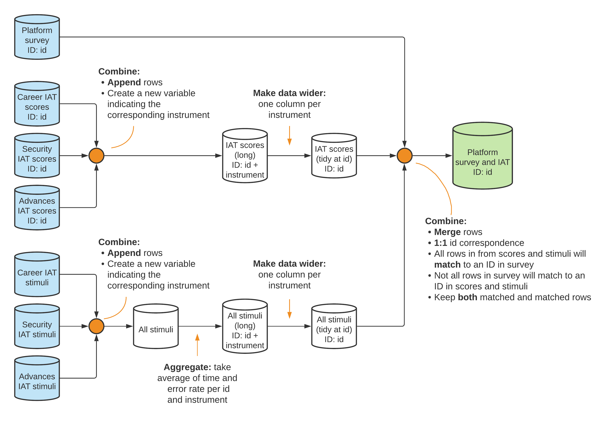

# Establishing a measurement framework {#measurement}

The first step in the data workflow is to establish a measurement framework.
This requires understanding your project's data requirements
and how to structure the required data to answer the research questions.
Setting up the measurement framework involves more than
simply listing the key outcome variables.
You also need to understand how to structure original data,
to determine how different data sources connect together,
and to create tools to document these decisions and
communicate them to the full research team.
In this chapter we will show how to develop this framework,
and hope to convince you that planning in advance both
saves time and increases research quality.

The first section of this chapter
introduces the *DIME Data Map Template*.
The template includes a data linkage table,
master datasets, and data flowcharts.
These tools are used to communicate the project's data requirements
across the team and over time.
The second section discusses how to
translate your project's research design into data needs.
It provides examples on the specific data required by
common impact evaluation research designs,
and how to document the linkage between
research design and data sources in our data map template.
The final section links the measurement framework to the
reproducibility and credibility pillars introduced in Chapter \@ref(reproducibility).
It covers how to reproducibly generate research design variables
and how to user power calculations and randomization inference
to assess credibility.

```{block2, type = "summary"}
### Summary: Establishing a measurement framework {-}

To be useful for research, original data must be mapped to a research design through a *measurement framework*. The measurement framework links each of the projects’ datasets to the research design and establishes their connections and relationships. Elaborating the measurement framework at the start of a research project ensures all team members have the same understanding and creates documentation that will prove useful over the full research cycle. The measurement framework includes several key outputs:
  
**1.	The data map documents:**
  
- All datasets, units of observation, and high-level relationships between datasets, in a *data linkage table*
- The *master datasets* for each unit of observation, which define the statistical populations of interest
- The expected ways in which datasets will be combined in data processing and analysis, with *data flowcharts* as a visual guide

**2.	The research design variables**, which translate the research design into data. These can include:
  
- *Treatment and sampling variables*, such as comparison groups, clusters and strata, and other variables which describe how units of observation relate to the proposed analytical methodology
- *Time variables*, which may be regular or irregular and serve to structure the data temporally
- *Monitoring indicators*, which characterize the implementation of activities under study or data 

**3.	Outputs of random processes**. Random processes, implemented through statistical software, are often needed to translate research designs into data work. These random processes share common characteristics and can include:
  
- *Random sampling*, to choose a representative subset of the population of interest to follow for the study
- *Random treatment assignment*, to determine which units will be placed into which experimental condition in a randomized control trial
- More complex designs, such as *clustering* or *stratification*, which require special considerations

#### Takeaways{-}

**TTLs/PIs will:**
  
- Oversee and provide inputs to the development of data linkage tables, master dataset(s), and data flowcharts; review and approve the complete data map.
- Supervise the generation of all research design variables required to execute the study design, and establish guidelines for any research design variables that require data collection
- Provide detailed guidance on the expected function and structure of random processes 

**RAs will:**
  
- Develop all components of the data map template, and maintain these throughout the project lifecycle, documenting any changes to data structure or units of observation.
- Understand the study design and how that translates to the project’s data structure.
- Transparently and reproducibly generate all research design variables, taking care to follow the best practices protocols for random processes.  
 
#### Key Resources{-}

- Detailed DIME Wiki articles explaining the data map components:
  -	**Data linkage table**: https://dimewiki.worldbank.org/Data_Linkage_Table
  -	**Data flowchart**: https://dimewiki.worldbank.org/Data_Flow_Chart
  -	**Master datasets**: https://dimewiki.worldbank.org/Master_Data_Set
- **Appendix \@ref(design)** of this book includes intuitive descriptions of common impact evaluation research designs, targeted to research staff without PhD training such as research assistants and field coordinators

```

## Documenting data needs {-}

Most projects require more than one data source to answer a research question.
These could be data from multiple survey rounds,
data acquired from different partners
(such as administrative data, implementation data, sensor data),
technological tools like satellite imagery or web scraping,
or complex combinations of these and other sources.^[
  See @kondylis2018speed for an example of a project using an innovative combination of administrative and survey data.]
However your study data is structured,
you need to know how to link data from all sources
and analyze the relationships between units
to answer your research questions.
You might think that you are able to keep all the relevant details in your head,
but the whole research team is unlikely to have the same understanding,
over the whole lifecycle of the project, of the relationship between all required datasets.
To make sure that the full team shares the same understanding,
we recommend creating a **data map**\index{data map}.^[
  More details on DIME's data map template
  and links to related topics with examples
  can be found on the DIME Wiki:
	https://dimewiki.worldbank.org/Data_Map.]
The purpose of the data map is to make sure that
you have all data that you need
to answer the research questions in your research design,
well before starting the analysis process described in Chapter \@ref(analysis).
It is also useful documentation for the project.
The process of drafting the data map is a useful
opportunity for principal investigators
to communicate their vision of the data structure and requirements,
and for research assistants to communicate
their understanding of that vision.
Our recommended best practice is that
the data map is completed before any data is acquired and
that it is made a part of the pre-registration of the study.
However, in practice many research projects evolve
as new data sources, observations, and research questions arise,
and then it is important that each component of the Data Map is continuously maintained and updated.

DIME's data map template has three components:
one *data linkage table*,
one or several *master datasets*
and one or several *data flowcharts*.
The **data linkage table**^[
  More details on DIME's data linkage table template
  and an example can be found on the DIME Wiki:
	https://dimewiki.worldbank.org/Data_Linkage_Table.]
lists all the original datasets that will be used in the project,
what data sources they are created from,
and how they relate to each other.
For each **unit of observation**^[
  More details on the concept of unit of observations
  can be found on the DIME Wiki:
	https://dimewiki.worldbank.org/Unit_of_Observation.]
in the data linkage table,
as well for each unit of analysis you plan to use,
you will create and maintain a **master dataset**^[
  More details on DIME's master dataset template
  and an example can be found on the DIME Wiki:
	https://dimewiki.worldbank.org/Master_Data_Set.],
listing all observations of that unit relevant to the project.
Finally, using these two resources
you will create **data flowcharts**,^[
  More details on DIME's data flowchart template
  and an example can be found on the DIME Wiki:
	https://dimewiki.worldbank.org/Data_Flow_Chart.]
describing how the original datasets and master datasets
are to be combined and manipulated to create analysis datasets.
Each component will be discussed in more detail below.

In order to map measurement frameworks into data needs,
we find it helpful to distinguish between two types of variables:
variables that tie your research design
to the observations in the data,
which we call *research design variables*;
and variables that correspond to observations of the real world,
which we call *measurement variables*.
*Research design variables* map information
about your research subjects to the research design.
Often, these variables have no meaning outside the research project,
for example ID variables and treatment status.
Others will be observations from the real world,
but only those that determines how each specific research unit
should be handled during the analysis,
for example treatment uptake and eligibility status.
*Measurement variables*, on the other hand,
are real world measures that are not determined by the research team.
Examples include characteristics of the research subject,
outcomes of interest, and control variables among many others.


### Developing a data linkage table {-}

To create a data map according to DIME's template,\index{data linkage table}
the first step is to create a **data linkage table** by listing
all the data sources you know you will use in a spreadsheet,
and the original datasets that will be created from them.
If one source of data will result in two different datasets,
then list each dataset on its own row.
For each dataset, list the unit of observation
and the name of the **project ID**^[
	**Project ID:** The main ID used in your project to identify
	observations.
	You should never have multiple project IDs for the same unit of observation.
	The project ID must uniquely and fully identify all observations in the project.
	See https://dimewiki.worldbank.org/ID_Variable_Properties#Project_ID for more details.]
variable for that unit of observation.
It is important to include both plain-language terminology
as well as technical file and variable names here.
For example, the `hh_baseline2020_listmap.csv` dataset
may be called the "Baseline Household Listing" data;
it may be identified by the `hh_id` variable
and said to be identified at the "Household" level.
Having the plain-language terminology here early in the project
allows you to use these titles unambiguously in communication.

The data linkage table will therefore help you plan out
how you will identify each unit of observation in your data.
When you list a dataset in the data linkage table --
which should be done before that data source is acquired --
you should make sure that the data will
be fully and uniquely identified by the project ID,
or make a plan for how the new dataset will be linked to the project ID.
It is very labor-intensive to work with a dataset that
does not have an unambiguous way to link to the project ID,
and it is a major source of error.^[
  See @fernandes2017evaluation for an example.]

The data linkage table should indicate whether
datasets can be merged one-to-one (for example,
merging baseline and endline datasets
that use the same unit of observation),
or whether two datasets need to be merged many-to-one
(for example, school administrative data merged with student data).
Your data map must indicate which ID variables
can be used -- and how -- when merging datasets.
The data linkage table is also a great place to list other metadata,
such as the source of your data, its backup locations,
the nature of the data license, and so on.

```{block2, type = 'ex'}
### Demand for Safe Spaces Example: Developing a Data Linkage Table (linkage)

The main unit of observation in the platform survey datasets is the respondent and it is uniquely identified by the variable id. However, implicit association tests (IAT) were collected through a specialized software that outputs two datasets for each IAT instrument: one at respondent level, containing the final scores; and one with detailed information on each stimulus used in the test (images or expressions to be associated with concepts). Three IAT instruments were used: one testing the association between gender and career choices; one testing the association between car choice and safety concerns; and one testing the association between car choice and openness to sexual advances. 

As a result, the original data for the platform survey component of the project consisted in 7 datasets: 1 for the platform survey, and 6 for the IAT -- 3 with IAT scores (one for each instrument) and 3 with detailed stimuli data (one for each instrument). All 7 datasets are stored in the same raw data folder. The data linkage table lists their file names and indicates how their ID variables are connected. Note that the raw stimulus data does not have a unique identifier, since the same stimulus can be shown repeatedly, so the “ID var” field is blank for these datasets.

| Data source	| Raw dataset name | Unit of observation <br> (ID var) |	Parent unit <br> (ID var) |
|-------------|------------------|---------------------------------|--------------------------|
| Platform survey	| platform_survey_raw_deidentified.dta	| respondent (id)	 | |
| Gender-career <br> implicit association test	| career_stimuli.dta	| stimulus	| respondent (id) <br> question block (block) |
| Car choice-safety concerns <br> implicit association test	| security_stimuli.dta	| stimulus	| respondent (id) <br> question block (block)| 
| Car choice-openness to advances <br> implicit association test	| reputation_stimuli.dta |	stimulus	| respondent (id) <br> question block (block) |
| Gender-career <br> implicit association test |	career_score.dta |	respondent (id)	 ||
| Car choice-safety <br> concerns implicit association test |	security_score.dta	| respondent (id)	 ||
| Car choice-openness to advances <br> implicit association test |	reputation_score.dta	| respondent (id)	 ||

> The complete project data map is available at https://git.io/Jtg3J.

```

### Constructing master datasets {-}

The second step in creating a data map is to create one **master dataset**
for each unit of observation that will be used in any research activity.
Examples of such activities are data collection, data analysis,
sampling, and treatment assignment.\index{master dataset}
The master dataset is the authoritative source
of the project ID and all research design variables\index{research design variables}
for the corresponding unit of observation,
such as sample status and treatment assignment.
Therefore, the master dataset serves as an unambiguous method of mapping
the observations in the data to the research design.
A master dataset should not include any measurement variables.
Research design variables and measurement variables
may come from the same source,
but should not be stored in the same way.
For example, if you acquire administrative data that both includes
information on eligibility for the study (research design variables)
and data on the topic of your study (measurement variables),
the data should be processed such that research design variables are stored in the master dataset,
while measurement variables should be stored separately and prepared for analysis
as described in Chapter \@ref(processing).

Each master dataset is to be the authoritative source
for how all observations at that unit of analysis are identified.
This means that the master datasets should include
identifying information such as names, contact information,
and the project ID.
The project ID is the ID variable used in the data linkage table,
and is therefore how observations are linked across datasets.
Your master dataset may list alternative IDs that are used,
for example, by a partner organization.
However, you must not use such an ID as your project ID,
as you would then not be in control over
who can re-identify data.
The project ID must be created by the project team,
and the linkage to direct identifiers
should only be known to people listed on the IRB.
Your master dataset serves as the linkage between
all other identifying information and your project ID.
Since your master dataset is full of identifying information,
it must always be encrypted.
If you receive a dataset with an alternative ID,
you should replace it with your project ID as a part of de-identification
(see chapters \@ref(processing) and \@ref(publication) for more on de-identification).
The alternative ID should be stored in your master dataset
so it may be linked back to your data using the project ID if ever needed.
Any dataset that needs to retain an alternative ID for any reason
should be treated as confidential data;
it should always be encrypted and never published.

The starting point for the master dataset is typically a sampling frame
(more on sampling frames later in this chapter).
However, you should continuously update the master dataset with
all observations ever encountered in your project,
even if those observations are not eligible for the study.
Examples include new observations listed during monitoring activities
or observations that are connected to respondents in the study,
for example in a social network module.
This is useful because,
if you ever need to perform a record linkage such as a fuzzy match
on string variables like proper names,
the more information you have the fewer errors you are likely to make.
If you ever need to do a fuzzy match,
you should always do that between the master dataset
and the dataset without an unambiguous identifier.^[
  See @benhassine2018does for an example.]
You should not begin data cleaning or analysis until you have successfully merged
the project IDs from the master dataset.
When adding new observations to the master datasets,
always convince yourself beyond reasonable doubt
that the new observation is indeed a new observation.
Sometimes you will encounter different spellings in identifiers
and identifiers such as addresses may become outdated.

### Creating data flowcharts {-}

The third and final step in creating the data map is
to create **data flowcharts**.\index{data flowchart}
Each analysis dataset
(see Chapter \@ref(analysis) for discussion on why you likely need multiple analysis datasets)
should have a data flowchart showing how it was created.
The flowchart is a diagram
where each starting point is either a master dataset
or a dataset listed in the data linkage table.
The data flowchart should include instructions on how
the datasets can be combined to create the analysis dataset.
The operations used to combine the data could include:
appending, one-to-one merging,
many-to-one or one-to-many merging, collapsing, or a broad variety of others.
You must list which variable or set of variables
should be used in each operation,
and note whether the operation creates a new variable or combination of variables
to identify the newly linked data.
Datasets should be linked by project IDs when possible
(exceptions are time variables in longitudinal data,
and sub-units like farm plots that belong to farmers with project IDs).
Once you have acquired the datasets listed in the flowchart,
you can add to the data flowcharts the number of observations that
the starting point dataset has
and the number of observation each resulting datasets
should have after each operation.
This is a great method to track attrition and to make sure that
the operations used to combine datasets did not create unwanted duplicates
or incorrectly drop any observations.

The information that goes into the data flowcharts can be expressed in text,
but our experience is that diagrams are the most efficient way to communicate this information across a team.
A data flowchart can be created in a flowchart drawing tool
(there are many free alternatives online) or
by using the shapes or SmartArt tools in, for example, Microsoft Office.
You can also do this simply by drawing on a piece of paper and taking a photo,
but we recommend a digital tool
so that flowcharts can easily be updated over time if needed.
As with the data linkage table,
you should include both technical information
and plain-language interpretations
of the operations that are done and the data that is created.
These will help readers understand the complex data combinations
that often result from merges and appends,
such as panel datasets like "person-year" structures
and multi-level data like "district-school-teacher-student" structures.

```{block2, type = "ex"}
### Demand for Safe Spaces Example: Creating Data Flowcharts

The data flowchart indicates how the original datasets are processed and combined to create a final respondent-level dataset that will be used for analysis. The analysis dataset resulting from this process is shown in green. The original  datasets are shown in blue (refer to the data linkage table example for details on the original datasets). The name of the uniquely identifying variable in the dataset is indicated in the format (ID: variable_name).

Each operation that changes the level of observation of the data is summarized in the flowchart. The chart also summarizes how datasets will be combined. Since these are the most error-prone data processing tasks, having a high-level plan for how they will be executed helps clarify the process for everyone in the data team, preventing future mistakes.


 
> The complete project data map is available at https://git.io/Jtg3J. 

```

## Translating research design to data needs {-}

An important step in translating the research design to specific data
structure is to determine which research design variables you will need in the data analysis
to infer what differences in measurement variables
are attributable to your research design.\index{research design variables}
These data needs should be expressed in your data map by
listing the data source for each variable in the data linkage table,
by adding columns for them in your master dataset
(the master dataset might not have any observations yet; that is not a problem),
and by indicating in your data flowcharts how they will be merged to the analysis data.
It is important you do this before acquiring any data,
to make sure that the data acquisition activities described in Chapter \@ref(acquisition)
will generate the data needed to answer your research questions.

As DIME primarily works on impact evaluations,
we focus our discussion here on research designs
that compare a group that received
some kind of **treatment**\index{treatment}^[
	**Treatment:** The general word for the evaluated intervention or event.
	This includes things like being offered a training,
	a cash transfer from a program,
	or experiencing a natural disaster, among many others.]
against a **counterfactual**\index{counterfactual}.^[
	**Counterfactual:** A statistical description of
	what would have happened
	to specific individuals in an alternative scenario,
	for example, a different treatment assignment outcome.]
The key assumption is that each
person, facility, or village
(or whatever the unit of treatment is)
had two possible states: their outcome if they did receive the treatment
and their outcome if they did not receive that treatment.
The average impact of the treatment,^[
	**Average treatment effect (ATE):**
	The expected average change in outcome
	that untreated units would have experienced
	had they been treated.]
is defined as the difference
between these two states averaged over all units.

However, we can never observe the same unit
in both the treated and untreated state simultaneously,
so we cannot calculate these differences directly.
Instead, the treatment group is compared to a control group
that is statistically indistinguishable,
which is often referred to as achieving
**balance** between two or more groups.
DIME Analytics maintains a Stata command to
standardize and automate the creation of well-formatted balance tables:
`iebaltab`.^[
  Read more about how to install and use `iebaltab`
  and how it simplifies balance tables in Stata on the DIME Wiki:
	https://dimewiki.worldbank.org/iebaltab.]
Each research design has a different method for
identifying and balancing the counterfactual group.
The rest of this section covers how research data requirements
differ between those different methods.
What does not differ, however,
is that these data requirements are all research design variables.
And that the research design variables discussed below
should always be included in the master dataset.
You will often have to merge
the research design variables to other datasets,
but that is an easy task
if you created a data linkage table.

We assume you have a working familiarity
with the research designs mentioned here.
You should reference **Appendix \@ref(design)**,
where you will find more details
and specific references for common impact evaluation designs.

### Applying common research designs to data {-}

<!-- Experimental design -->
In **experimental research designs**,
such as **randomized control trials (RCTs)**,^[
  More details on RCTs and links to even more extensive resources
  can be found on the DIME Wiki:
	https://dimewiki.worldbank.org/Randomized_Control_Trials.]
  \index{randomized control trials}\index{experimental research designs}
the research team determines which members
of the studied population will receive the treatment.
This is typically done by a randomized process
in which a subset of the eligible population
is randomly assigned to receive the treatment
(see later in this chapter for how to implement this).
The intuition is that if everyone in the eligible population
is assigned at random to either the treatment or control group,
then the two groups will, on average, be statistically indistinguishable.
Randomization makes it generally possible to obtain unbiased estimates of
the effects that can be attributed to a specific program or intervention:
in a randomized trial, the expected spurious correlation between treatment and outcomes
will approach zero as the sample size increases.^[@duflo2007using, @JPAL2020rct]
The randomized assignment should be done
using data from the master dataset,
and the result should be saved back to the master dataset,
before being merged to other datasets.

<!-- Quasi-experimental design -->
**Quasi-experimental research designs**,^[
  More details on quasi-experimental research designs
  and links to even more extensive resources
  can be found on the DIME Wiki:
	https://dimewiki.worldbank.org/Quasi-Experimental_Methods]
\index{quasi-experimental research designs}
by contrast, are based on events not controlled by the research team.
Instead, they rely on "experiments of nature",
in which natural variation in exposure to treatment
can be argued to approximate deliberate randomization.
You must have a way to measure this natural variation,
and how the variation is categorized as outcomes of a naturally randomized assignment
must be documented in your master dataset.
Unlike carefully planned experimental designs,
quasi-experimental designs typically require the luck
of having access to data collected at the right times and places
to exploit events that occurred in the past.
Therefore, these methods often use either secondary data,
including administrative data or other classes of routinely-collected information,
and it is important that your data linkage table documents
how this data can be linked to the rest of the data in your project.

<!-- Research design variables -->
No matter the design type, you should be very clear about
which data points you observe or collect are research design variables.
For example,
**regression discontinuity (RD)**^[
  More details on RD designs
  and links to even more extensive resources
  can be found on the DIME Wiki:
	https://dimewiki.worldbank.org/Regression_Discontinuity.]
  \index{regression discontinuity}
designs exploit sharp breaks or limits
in policy designs.^[
  See @alix2019can for an example.]
The cutoff determinant, or running variable,
should be saved in your master dataset.
In **instrumental variables (IV)**^[
  More details on IV designs
  and links to even more extensive resources
  can be found on the DIME Wiki:
	https://dimewiki.worldbank.org/Instrumental_Variables.]
  \index{instrumental variables}
designs, the **instruments** influence the *probability* of treatment.^[
  See @calderon2017opportunity for an example.]
These research design variables should be collected
and stored in the master dataset.
Both the running variable in RD designs
and the instruments in IV designs,
are among the rare examples of research design variables
that may vary over time.
In such cases your research design should
ex-ante clearly indicate what point of time they will be recorded,
and this should be clearly documented in your master dataset.

In **matching** designs, observations are often grouped
by a strata, grouping, index, or propensity score.^[
  More details on matching methods
  and links to even more extensive resources
  can be found on the DIME Wiki:
	https://dimewiki.worldbank.org/Matching.]
Like all research design variables, the matching results
should be stored in the master dataset.
This is best done by assigning a matching ID
to each matched pair or group,
and create a variable in the master dataset
with the matching ID each unit belongs to.^[
  See @prennushi2014women for an example.]
In all these designs, fidelity to the design is important to record as well.^[
  See @pradhan2013evaluating for an example.]
A program intended for students that scored under 50% on a test
might have some cases where the program is offered to someone that scored 51% at the test,
or someone that scored 49% at the might decline to participate in the program.
Differences between assignments and realizations
should also be recorded in the master datasets.

### Including multiple time periods {-}

Your data map should also take into consideration
whether your project uses data from one time period or several.
A study that observes data in only one time period is called
a **cross-sectional study**.\index{cross-sectional data}
Observations over multiple time periods,
referred to as **longitudinal data**\index{longitudinal data},
can consist of either
**repeated cross-sections**\index{repeated cross-sectional data}
or **panel data**\index{panel data}.
In repeated cross-sections,
each successive round of data collection uses a new random sample
of observations from the treatment and control groups,
but in a panel data study
the same observations are tracked and included each round.^[
  See @kondylis2016female for an example.]
If each round of data collection is a separate activity,
then they should be treated as separate sources of data
and get their own row in the data linkage table.

If the data is generated continuously,
or acquired at frequent intervals,
then it can be treated as a single data source.
When panel data is acquired in discreet batches,
the data linkage table must document
how the different rounds will be merged or appended.
You must keep track of the *attrition rate* in panel data,
which is the share of observations not observed in follow-up data.
It is common that the observations not possible to track
can be correlated with the outcome you study.^[
  See @bertrand2017contemporaneous for an example.]
For example, poorer households may live in more informal dwellings,
patients with worse health conditions might not survive to follow-up,
and so on.
If this is the case,
then your results might only be an effect of your remaining sample
being a subset of the original sample
that were better or worse off from the beginning.
You should have a variable in your master dataset
 that indicates attrition.
A balance check using the attrition variable
can provide insights as to whether the lost observations
were systematically different
compared to the rest of the sample.

### Incorporating monitoring data {-}

For any study with an ex-ante design,
**monitoring data**\index{monitoring data}^[
  More details on monitoring data can be found on the DIME Wiki:
	https://dimewiki.worldbank.org/Administrative_and_Monitoring_Data#Monitoring_Data
] 
is very important for understanding if the
research design corresponds to reality.
The most typical example is to make sure that,
in an experimental design,
the treatment was implemented according to your treatment assignment.
Treatment implementation is often carried out by partners,
and field realities may be more complex than foreseen during research design.
Furthermore, the field staff of your partner organization,
might not be aware that their actions are the implementation of a research design.

Therefore, you must acquire monitoring data that
tells you how well the realized treatment implementation in the field
corresponds to your intended treatment assignment,
for nearly all experimental research designs.
While monitoring data has traditionally been collected by sending someone to the field ,
it is increasingly common to collect monitoring data remotely.
Some examples of remote monitoring include:
local collaborators uploading geotagged images for visible interventions (such as physical infrastructure),
installing sensors to broadcast measurements (such as air pollution or waterflow),
distributing wearable devices to track location or physical activity (such as fitbits),
or applying image recognition to satellite data.
In-person monitoring activities are often preferred but
cost and travel dangers, such as conflicts or disease outbreaks,
make remote monitoring innovations increasingly appealing.
If cost alone is the constraint,
consider sampling a subset of the implementation area to monitor in-person.
This may not be detailed enough to be used as a control in your analysis,
but it will still provide a means to
estimate the validity of your research design assumptions.

Linking monitoring data to the rest of the data in your project
is often complex and a major source of errors.
Monitoring data is rarely received in the same format or structure as your research data.^[
	See @goldstein2015formalizing for an example.]
For example, you may receive a list of the names of all people who attended a training,
or administrative data from a partner organization without a proper identifier.
In both those cases it can be difficult to ensure a one-to-one match
between units in the monitoring data and the master datasets.
Planning ahead, and collaborating closely with the implementing
organization from the outset of the project,
is the best way to avoid these difficulties.
Often, it is ideal for the research team to prepare forms (paper or electronic) for monitoring,
preloading with names of sampled individuals,
or ensuring that there is a consistent identifier that is directly linkable to the project ID.
If monitoring data is not handled carefully, you risk ending up with poor correlation
between treatment uptake and treatment assignment,
without a way to tell if the poor correlation is just
a result of poor matching of the monitoring data or a meaningful implementation problem.

## Creating research design variables by randomization {-}

Random sampling and random treatment assignment
are two core research activities
that generate important research design variables.
Random sampling and random treatment assignment directly determine
the set of individuals who will be observed
and what their status will be for the purpose of effect estimation.
**Randomization**^[
	**Randomization** is often used interchangeably
	to mean random treatment assignment.
	In this book however, *randomization* will only
	be used to describe the process of generating
	a sequence of unrelated numbers, i.e. a random process.
	*Randomization* will never be used to mean
	the process of assigning units in treatment and control groups,
	that will always be called *random treatment assignment*,
	or a derivative thereof.]
is used to ensure that a sample is representative and
that treatment groups are statistically indistinguishable.

Randomization in statistical software is non-trivial
and its mechanics are unintuitive for the human brain.
The principles of randomization we will outline
apply not just to random sampling and random assignment,
but to all statistical computing processes that have random components
such as simulations and bootstrapping.
Furthermore, all random processes introduce statistical noise
or uncertainty into estimates of effect sizes.
Choosing one random sample from all the possibilities produces some probability of
choosing a group of units that are not, in fact, representative.
Similarly, choosing one random assignment produces some probability of
creating groups that are not good counterfactuals.
*Power calculation* and *randomization inference*
are the main methods by which these probabilities of error are assessed.
These analyses are particularly important in the initial phases of development research --
typically conducted before any data acquisition or field work occurs --
and have implications for feasibility, planning, and budgeting.

### Randomizing sampling and treatment assignment {-}

<!-- sampling universe: the master dataset -->
**Sampling** is the process of randomly selecting observations
from a list of individuals to create a representative or statistically similar sub-sample.\index{sampling}
This process can be used, for example, to select a subset from all eligible units
to be included in data collection when the cost of collecting data on everyone is prohibitive.^[
  More details on sampling and important consideration related to sample size,
  as well as links to even more extensive resources
  can be found on the DIME Wiki:
	https://dimewiki.worldbank.org/Sample_Size_and_Power_Calculations.]
But it can also be used to select a sub-sample of your observations to test a computationally heavy process
before running it on the full data.
**Randomized treatment assignment** is the process of assigning observations to different treatment arms.
This process is central to experimental research design.
Most of the code processes used for randomized assignment are the same as those used for sampling,
since it is also a process of randomly splitting a list of observations into groups.
Where sampling determines whether a particular individual
will be observed at all in the course of data collection,
randomized assignment determines if each individual will be observed
as a treatment observation or used as a counterfactual.

The list of units to sample or assign from may be called a **sampling universe**,
a **listing frame**, or something similar.
The starting point for randomized sampling or assignment
should be a **master dataset** in almost all cases,
and the result of the randomized process should always be saved in the master dataset
before it is merged to any other data.
Example of exceptions
when this cannot start from a master dataset are:
sampling done in real time, such as randomly sampling patients
as they arrive at a health facility, and
treatment assignment done through an in-person lottery.
In those cases,
it is important that you collect enough data
during the real time sampling,
or take care to prepare the inputs for the lottery
such that you can add these individuals
to your master dataset afterwards.

<!-- implement uniform-probability random sampling -->
The simplest form of sampling is
**uniform-probability random sampling**.
This means that every eligible observation in the master dataset
has an equal probability of being selected.
The most explicit method of implementing this process
is to assign random numbers to all your potential observations,
order them by the number they are assigned,
and mark as "sampled" those with the lowest numbers, up to the desired proportion.
There are a number of shortcuts to doing this process,
but they all use this method as the starting point,
so you should become familiar with exactly how it works.
The do-file below provides an example of
how to implement uniform-probability sampling in practice.
This code uses a Stata built-in dataset and is fully reproducible
(more on reproducible randomization in next section),
so anyone that runs this code in any version of Stata later than 13.1
(the version set in this code)
will get the exact same, but still random, results.

```{stata, eval = F, code = readLines("code/simple-uniform-probability-sampling.do"), attr.source='.numberLines'}
```

Sampling typically has only two possible outcomes: observed and unobserved.
Similarly, a simple randomized assignment has two outcomes: treatment and control,
and the logic in the code would be identical to the sampling code example.
However, randomized assignment often involves multiple treatment arms
which each represent different varieties of treatments to be delivered;^[
  See @de2013helping for an example.]
in some cases, multiple treatment arms are intended to overlap in the same sample.
Complexity can therefore grow very quickly in randomized assignment
and it is doubly important to fully understand the conceptual process
that is described in the experimental design,
and fill in any gaps before implementing it in code.
The do-file below provides an example of how to implement
a randomized assignment with multiple treatment arms.

```{stata, eval = F, code = readLines("code/simple-multi-arm-randomization.do"), attr.source='.numberLines'}
```

### Programming reproducible random processes {-}

<!-- what it means for randomization to be reproducible -->
For statistical programming to be reproducible,
you must be able to re-obtain its exact outputs in the future.^[@orozco2018make]
We will focus on what you need to do to produce
truly random results for your project,
to ensure you can get those results again.
This takes a combination of strict rules, solid understanding, and careful programming.
This section introduces strict rules:
these are non-negotiable (but thankfully simple).
Stata, like most statistical software, uses a **pseudo-random number generator**^[
	**Pseudo-random number generator:** An algorithm that creates a long, fixed sequence of numbers
  which exhibits no statistical relationships between the position or value of any set of those numbers.]
which, in ordinary research use,
produces sequences of number that are as good as random.^[
  More details on randomization in Stata
  and the three important steps that needs to be followed
  to make it reproducible can be found on the DIME Wiki:
	https://dimewiki.worldbank.org/Randomization_in_Stata.]
However, for *reproducible* randomization, we need two additional properties:
we need to be able to fix the sequence of numbers generated and
we need to ensure that the first number is independently randomized.
In Stata, this is accomplished through three concepts:
**versioning**, **sorting**, and **seeding**.
We again use Stata in our examples,
but the same principles translate to all other programming languages.

<!-- rule 1: versioning -->
- **Rule 1: Versioning** requires using the same version of the software each time you run the random process.
If anything is different, the underlying list of random numbers may have changed,
and it may be impossible to recover the original result.
In Stata, the `version` command ensures that the list of random numbers is fixed.^[
	At the time of writing, we recommend using `version 13.1` for backward compatibility;
	the algorithm used to create this list of random numbers was changed after Stata 14 but the improvements do not matter in practice.]
The `ieboilstart` command in `ietoolkit` provides functionality to support this requirement.^[
  Read more about how to install and use `ieboilstart`
  and how this command can help you
  harmonize settings such as version across users on the DIME Wiki:
	https://dimewiki.worldbank.org/ieboilstart.]
We recommend you use `ieboilstart` at the beginning of your master do-file.^[
  More details and description of each section of our template master do-file
  can be found on the DIME Wiki:
	https://dimewiki.worldbank.org/Master_Do-files.]
Note that testing your do-files without running them
via the master do-file may produce different results,
since Stata's `version` setting expires after each time you run your do-files.

<!-- rule 2: sorting -->
- **Rule 2: Sorting** requires that the order of the actual data that the random process is run on is fixed.
Because random numbers are assigned to each observation row-by-row starting from
the top row,
changing their order will change the result of the process.
In Stata, we recommend using `isid [id_variable], sort`
to guarantee a unique sorting order.
This command does two things.
First it tests that all observations have unique values in the sort variable,
as duplicates would cause an ambiguous sort order.
If all values are unique,
then the command sorts on this variable guaranteeing a unique sort order.
It is a common misconception that the `sort, stable` command
may also be used,
but by itself it cannot guarantee an unambiguous sort order
and is therefore not appropriate for this purpose.
Since the exact order must be unchanged,
the underlying data itself must be unchanged as well between runs.
This means that if you expect the number of observations to change
(for example to increase during ongoing data collection),
your randomization will not be reproducible unless you split your data up into
smaller fixed datasets where the number of observations does not change.
You can combine all
those smaller datasets after your randomization.

<!-- rule 3: seeding -->
- **Rule 3: Seeding** requires manually setting the start point in the list of pseudo-random numbers.
A seed is just a single number that specifies one of the possible start points.
It should be at least six digits long and you should use exactly
one unique, different, and randomly created seed per randomization process.^[
  You can draw a uniformly distributed six-digit seed randomly by visiting https://bit.ly/stata-random.
	(This link is a just shortcut to request such a random number on https://www.random.org.)
	There are many more seeds possible but this is a large enough set for most purposes.]
In Stata, `set seed [seed]` will set the generator
to the start point identified by the seed.
In R, the `set.seed` function does the same.
To be clear: you should not set a single seed once in the master do-file,
but instead you should set a new seed in code right before each random process.
The most important thing is that each of these seeds is truly random,
so do not use shortcuts such as the current date or a seed you have used before.
You should also describe in your code how the seed was selected.

<!-- testing randomization reproducibility -->
You must carefully confirm exactly how your code runs before finalizing it,
as other commands may induce randomness in the data,
change the sorting order,
or alter the place of the random generator without you realizing it.
To confirm that a randomization has worked correctly before finalizing its results,
save the outputs of the process in a temporary location,
re-run the code, and use `cf` or `datasignature` to ensure
nothing has changed. It is also advisable to let someone else reproduce your
randomization results on their machine to remove any doubt that your results
are reproducible.
Once the result of a randomization is used in the field,
there is no way to correct any mistakes.
The code below provides an example of a fully reproducible randomization.

```{stata, eval = F, code = readLines("code/reproducible-randomization.do"), attr.source='.numberLines'}
```

As discussed above, at times it will not be possible to use a master dataset for
randomized sampling or treatment assignment
(examples were sampling patients on arrival or live lotteries).
In addition to presenting challenges with matching,
these methods typically do not leave a record of the randomization,
and as such are never reproducible.
However, you can often run your randomization in advance
even when you do not have list of eligible units in advance.
Let's say you want to, at various health facilities,
randomly select a sub-sample of patients as they arrive.
You can then have a pre-generated list
with a random order of "in sample" and "not in sample".
Your field staff would then go through this list in order
and cross off one randomized result as it is used for a patient.

This is especially beneficial if you are implementing a more complex randomization.
For example, a hypothetical research design may call for enumerators to:

1. sample 10% of people observed in a particular location;
1. show a video to 50% of the sample;
1. administer a short questionnaire to 80% of all those sampled; and 
1. administer a longer questionnaire to the remaining 20%, with the questionnaire mix equal between those who were shown the video and those that were not.

In real-time, such a complex randomization is much more likely to be implemented correctly
if your field staff simply can follow a list with the randomized categories
where you are in control of the pre-determined proportions and the random order.
This way, you can also control with precision
how these categories are evenly distributed across all the locations
where you plan to conduct this research.

Finally, if this real-time randomization implementation is done using survey software,
then the pre-generated list of randomized categories can be preloaded
into the questionnaire.
Then the field team can follow a list of respondent IDs
that are randomized into the appropriate categories,
and the survey software can show a video and control which version of the questionnaire is asked.
This way, you reduce the risk of errors in field randomization.

### Implementing clustered or stratified designs {-}

<!-- the cases discussed so far are the most simple, but not the most common -->
For a variety of reasons, random sampling and random treatment assignment
are rarely as straightforward as a uniform-probability draw.
The most common variants are **clustering** and **stratification**.^[@athey2017econometrics]
**Clustering** occurs when your unit of analysis is different
than the unit of sampling or treatment assignment.^[
  More details on the concepts of unit of sampling
  and unit treatment assignment
  can be found on the DIME Wiki:
	go to https://dimewiki.worldbank.org/Unit_of_Observation]
For example, a policy may be implemented at the village level,
or you may only be able to send enumerators to a limited number of villages,
or the outcomes of interest for the study are measured at the household level.^[
  More details on clustered sampling and
  links to additional resources can be found on the DIME Wiki:
	https://dimewiki.worldbank.org/Multi-stage_(Cluster)_Sampling.]
\index{clustered randomization}
The groups in which units are assigned to treatment are called clusters.^[
  See @keating2011evaluating for an example.]

**Stratification** breaks the full set of observations into subgroups
before performing randomized assignment within each subgroup.^[
  More details on stratified sampling and
  links to additional resources can be found on the DIME Wiki:
	https://dimewiki.worldbank.org/Stratified_Random_Sample.]
\index{stratification}
The subgroups are called **strata**.
This ensures that members of every subgroup
are included in all groups of the randomized assignment process,
or that members of all groups are observed in the sample.
Without stratification, it is possible that the randomization
would put all the members of a subgroup into just one of the treatment arms,
or fail to select any of them into the sample.
For both clustering and stratification,
implementation is nearly identical in both random sampling and random assignment.

Clustering is procedurally straightforward in Stata,
although it typically needs to be performed manually.
To cluster a sampling or randomized assignment,
randomize on the master dataset for the unit of observation of the cluster,
and then merge the results to the master dataset for the unit of analysis.
This is a many-to-one merge and your data map should document
how those datasets can be merged correctly.
If you do not have a master dataset yet for the unit of observation of the cluster,
then you first have to create that and update your data map accordingly.
When sampling or randomized assignment is conducted using clusters,
the clustering variable should be clearly identified in the master dataset
for the unit of analysis
since it will need to be used in subsequent statistical analysis.
Namely, standard errors for these types of designs must be clustered
at the level at which the randomization was clustered.^[
	https://blogs.worldbank.org/impactevaluations/when-should-you-cluster-standard-errors-new-wisdom-econometrics-oracle]
This accounts for the design covariance within the cluster --
the information that if one individual was observed or treated there,
the other members of the clustering group were as well.

Although procedurally straightforward,
implementing stratified designs in statistical software is prone to error.
Even for a simple multi-armed design,
the basic method of randomly ordering the observations
will often create very skewed assignments.^[
	https://blogs.worldbank.org/impactevaluations/tools-of-the-trade-doing-stratified-randomization-with-uneven-numbers-in-some-strata]
The user-written `randtreat` command properly implements stratification.^[@carril2017dealing]
The options and outputs (including messages) from the command should be carefully reviewed
so that you understand exactly what has been implemented.
Notably, it is extremely hard to target precise numbers of observations
in stratified designs, because exact allocations are rarely round fractions
and the process of assigning the leftover "misfit" observations
imposes an additional layer of randomization above the specified division.

### Performing power calculations {-}

Random sampling and treatment assignment are noisy processes:
it is impossible to predict the result in advance.
By design, we know that the exact choice of sample or treatment
will be uncorrelated with our key outcomes,
but this lack of correlation is only true "in expectation" --
that is, the noise component of the correlation between randomization and outcome
will only be zero on average across a large number of randomized trials.
In any *particular* randomization,
the correlation between the sampling or randomized assignments and the outcome variable
is guaranteed to be *nonzero*:
this is called the **in-sample** or **finite-sample correlation**.

Since we know that the true correlation
(over the "population" of potential samples or randomized assignments)
is zero, we think of the observed correlation as an **error**.
In sampling, we call this the **sampling error**,
and it is defined as the difference between a true population parameter
and the observed mean due to chance selection of units.^[
  More details on sampling and
  links to additional resources can be found on the DIME Wiki:
	https://dimewiki.worldbank.org/Sampling.]
In randomized assignment, we call this the **randomization noise**,
and define it as the difference between a true treatment effect
and the estimated effect due to placing units in groups.
The intuition for both measures is that from any group,
you can find some possible subsets that have higher-than-average values of some measure;
similarly, you can find some that have lower-than-average values.
Your random sample or treatment assignment will fall in one of these categories,
and we need to assess the likelihood and magnitude of this occurrence.
*Power calculation* and *randomization inference* are the two key tools to doing so.^[
	More details on how to perform power calculations
  can be found on the DIME Wiki:
  https://dimewiki.worldbank.org/Sample_Size_and_Power_Calculations.]

**Power calculations** report the likelihood that your experimental design
\index{power calculations}
will be able to detect the treatment effects you are interested in
given these sources of noise.
This measure of **power** can be described in various different ways,
each of which has different practical uses.
The purpose of power calculations is to identify where the strengths and weaknesses
of your design are located, so you know the relative tradeoffs you will face
by changing your randomization scheme for the final design.
It is important to consider take-up rates and attrition when doing power calculations;
incomplete take-up will significantly reduce power,
understanding what minimum level of take-up is required can help guide field operations
(for this reason, monitoring take-up in real-time is often critical).

The **minimum detectable effect (MDE)**^[
  More details on minimum detectable effect and
  links to additional resources can be found on the DIME Wiki:
	https://dimewiki.worldbank.org/Minimum_Detectable_Effect.]
is the smallest true effect that a given research design can reliably detect.
This is useful as a check on whether a study is worthwhile.
If, in your field, a "large" effect is just a few percentage points
or a small fraction of a standard deviation,
then it is nonsensical to run a study whose MDE is much larger than that.
This is because, given the sample size and variation in the population,
the effect needs to be much larger to possibly be statistically detected,
so such a study would never be able to say anything about the effect size that is practically relevant.
Conversely, the **minimum sample size** pre-specifies expected effect sizes
and tells you how large a study's sample would need to be to detect that effect,
which can tell you what resources you would need
to implement a useful study.

**Randomization inference**^[
  More details on randomization inference and
  links to additional resources can be found on the DIME Wiki:
	https://dimewiki.worldbank.org/Randomization_Inference.]
is used to analyze the likelihood
\index{randomization inference}
that the randomized assignment process, by chance,
would have created a false treatment effect as large as the one you estimated.
Randomization inference is a generalization of placebo tests,
because it considers what the estimated results would have been
from a randomized assignment that did not in fact happen in reality.
Randomization inference is particularly important
in quasi-experimental designs and in small samples,
where the number of possible *randomizations* is itself small.
Randomization inference can therefore be used proactively during experimental design,
to examine the potential spurious treatment effects your exact design is able to produce.
If there is significant heaping at particular result levels,
or if results seem to depend dramatically on the outcomes for a small number of individuals,
randomization inference will flag those issues before the experiment is fielded
and allow adjustments to the design to be made.

## Looking ahead {-}

This chapter introduced the DIME Data Map template,
a toolkit to documents your data acquisition plan and
how each data source relates to the design of your study.
The data map contains research design variables and the instructions
for using them in combination with measurement variables, which together
will form the dataset(s) for your analytical work.
We then discussed ways for you to use this planning data
to inform and execute research design tasks,
such as randomized sampling and assignment,
and to produce concrete measures
of whether the project design is sufficient to answer the research questions you pose.
In the next chapter,
we will turn to the first step in actually answering those questions --
data acquisition.
The next chapter will detail the processes of obtaining
original data,
whether you are collecting it yourself or
receiving it from another entity.
