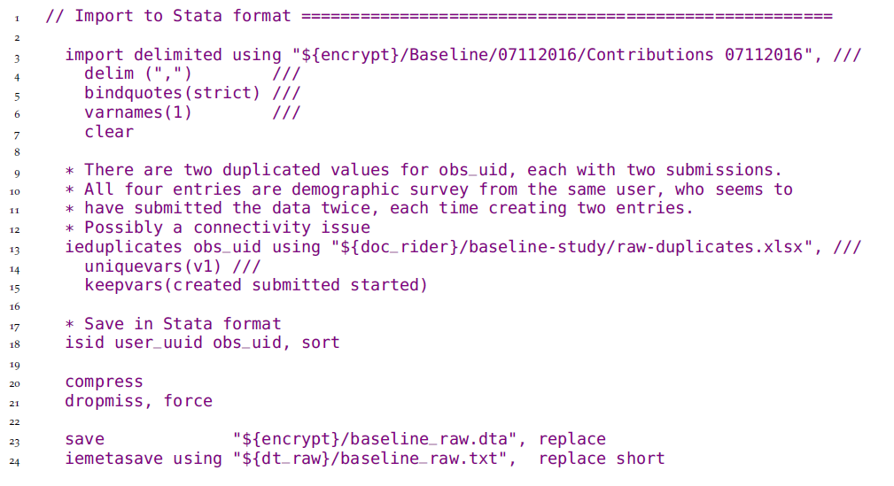
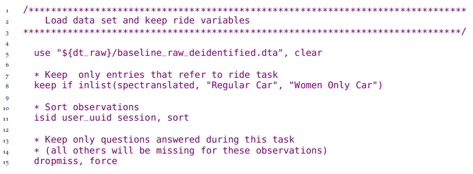
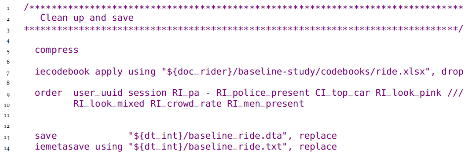
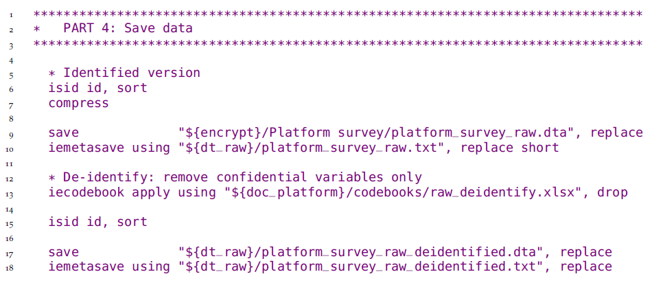
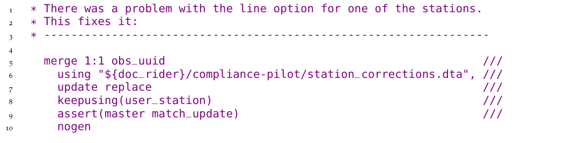
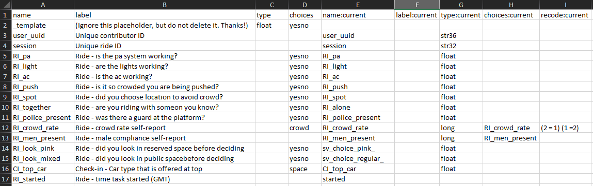
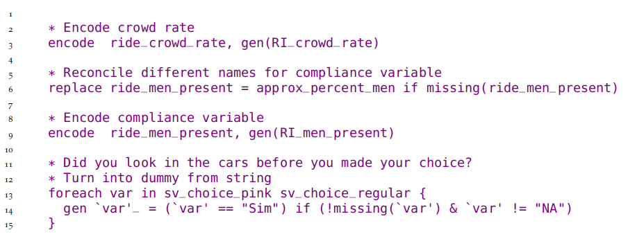

# Cleaning and processing research data {#processing}

<!-- What is data cleaning -->
Original data comes in a variety of formats,
most of which are not immediately suited for analysis.
The process of preparing data for analysis has many different names:
data cleaning, data munging, data wrangling.
But they all mean the same thing --
transforming data into a convenient format for your intended use.
This is the most time-consuming step of a project's data work,
particularly when primary data is involved;
it is also essential for data quality.
A structured workflow for preparing newly-acquired data for analysis
is essential for efficient, transparent, and reproducible data work.
One key point of this chapter is that no changes are made to the contents of data at this point.
We consider creating new variables, imputing values and correcting outliers
to be research decisions, and will discuss those in the next chapter.
Therefore, the clean dataset,
which is the main output from the workflow discussed in this chapter,
contains the same information as the original data,
but in a format that is ready for use with statistical software.

<!-- Chapter overview -->
This chapter describes the various tasks involved in making newly-acquired data ready for analysis.
The first section teaches you how to make your data *tidy*.
This means adjusting how the dataset is organized
until the relationship between rows and columns is well-defined.
The second section describes quality assurance checks,
which are necessary to verify data accuracy.
The third section covers de-identification,
as removing direct identifiers early in the data handling process helps to ensure privacy.
The final section discusses how to examine each variable in your dataset and
make sure that it is as well documented and as easy to use as possible.
Each of these tasks is implemented through code,
and resulting datasets can be reproduced exactly by running this code.
The original data files are kept exactly as they were acquired,
and no changes are made directly to them.

```{block2, type = 'summary'}
### Summary: Cleaning and processing research data {-}

After data is acquired, it must be structured for analysis in accordance with the research design, as laid out in the data linkage tables and the data flowcharts discussed in Chapter \@ref(measurement). Data processing requires first transforming the unprocessed materials from partners or data collection into the appropriate tables and units of observation, then producing clean datasets that match the ground truth observations. To do this, you will:

**1. Tidy the data.** Many datasets will not have an unambiguous identifier as received, and the rows in the dataset often will not match the units of observation specified by the research plan and data linkage table. To prepare the data for analysis, you must:
  
- Determine the *unique identifier* for each unit of observation that you require.
- Transform the data so that the desired *unit of observation* uniquely identifies rows in each dataset.

**2.	Validate data quality.** Data completeness and quality should be validated upon receipt to ensure the data is an accurate representation of the characteristics and individuals it is supposed to contain. This includes:

- Checking that the data is *complete*, that is, that all the expected observations were received and validated them against the sample.
- Making sure data points are *consistent* across variables and datasets.
- Exploring the *distributions* of key variables to identify outliers and other unexpected patterns.

**3.	De-identify, clean, and prepare the data.** You should archive and/or publish the data after processing and de-identifying. Before publication, you should ensure that the processed version is highly accurate and appropriately protects the privacy of individuals, by doing the following:
  
- *De-identifying the data*, in accordance with best practices and relevant privacy regulations.
- *Correcting data points* which are identified as being in error compared to ground reality.
- *Recoding, documenting, and annotating datasets* so that all dataset contents are fully interpretable by future users, whether or not they were involved in the acquisition process.

#### Takeaways{-}

**TTLs/PIs will:**
  
- Indicate the units of observation that are needed for experimental design and supervise development of appropriate unique identifiers
- Indicate priorities for quality checks, including key indicators and reference values
- Provide guidance on how to resolve all issues identified in data processing, cleaning and preparation
- Publish and/or archive the prepared dataset

**RAs will: **
  
- Develop code, data, and documentation linking datasets with data map and study design, and tidy all datasets to correspond to the required units of observation
- Manage data quality checks, clearly communicate issues to TTL/PI, data producers, and/or field teams 
- Implement data cleaning processes; generate and maintain detailed documentation
- Prepare dataset for publication by de-identifying, correcting field errors, and preparing documentation 

#### Key Resources {-}
- **iefieldkit stata package**: suite of commands to enable reproducible data cleaning and processing.
  - Explanation: https://dimewiki.worldbank.org/Iefieldkit. 
  - Code: https://github.com/worldbank/iefieldkit.
- **ietoolkit stata package**: suite of commands to enable reproducible data management and analysis.
  - Explanation:  https://dimewiki.worldbank.org/Ietoolkit. 
  - Code: https://github.com/worldbank/ietoolkit. 
- ***DIME Analytics Continuing Education Session on Tidying Data**: https://osf.io/p4e8u/ 
- **De-identification article on DIME Wiki**: https://dimewiki.worldbank.org/De-identification 

```

<!-- ------------------------------------------------ -->

## Making data "tidy" {-}

<!-- Intro -->
The very first step in creating an analysis-friendly dataset
is understanding the data acquired,
and using this understanding to translate the data into an intuitive format.
This section discusses what steps may be needed to make sure that each row
in your **data tables**^[
  **Data table:**
	data that is structured into rows and columns.
	Also called *tabular datasets* or *rectangular data*.
	Examples of non-rectangular data are written text,
	NoSQL and graph databases, or files such as images.
]
represents one observation.
Getting to such a format may be harder than expected,
and the **unit of observation**^[
  **Unit of observation:**
	the unit described by the data. In datasets, it is ideally what each row represents.
	More details on the concept of unit of observations
	can be found on the DIME Wiki:
  https://dimewiki.worldbank.org/Unit_of_Observation.
]\index{unit of observation}
may be ambiguous in many datasets.
This section will present what we call a *tidy* data format,
which is, in our experience, the ideal format to handle tabular data.
We will treat tidying data as the first step in data cleaning even though, in practice,
both tidying and quality monitoring should be done simultaneously as data is received.
This is because quality assurance can only be finalized using tidied data,
when it is guaranteed that each observation is uniquely identified.

<!-- ------------------------------------------------------------------------------ -->

### Establishing a unique identifier {-}

<!-- Uniquely and fully identifying variable -->
An important step before starting to tidy a dataset is
to understand the **unit of observation**
and find out which variable or set of variables
is the **unique identifier** for each observation.^[
	More details on the properties required for variables
	that uniquely identifies each observation
	can be found on the DIME Wiki:
  https://dimewiki.worldbank.org/ID_Variable_Properties.
]\index{unique identifier}
As discussed in Chapter \@ref(measurement),
the unique identifier will be used to link observations in this dataset
to data in other data sources according to the **data linkage table**,^[
	More details on DIME's data linkage table template
	and an example can be found on the DIME Wiki:
	https://dimewiki.worldbank.org/Data_Linkage_Table.]\index{data linkage table}
and the unique identifier for all observations
must be listed in the **master dataset**.^[
	More details on DIME's master dataset template
	and an example can be found on the DIME Wiki:
	https://dimewiki.worldbank.org/Master_Data_Set.]\index{master dataset}
Ensuring that observations are uniquely and fully identified
is arguably the most important step in data cleaning.
It may be the case that the variables expected to uniquely identify
the data contain either missing or duplicate values.^[
	We use the expression **original dataset**
	to refer to the "data in the state it was originally received by the research team".
 	In other sources, you will also see it used to refer to the
	"corrected and compiled dataset created from received information,
	reflecting only that information",
	which we call **clean data**.
	This applies to data acquired from partners as well as
	original data collected by the research team.
]

It is also possible that a dataset does not include an unique identifier,
or that the identifier is not a suitable **project ID**.^[
	More details on what makes an ID variable
	a suitable Project ID variable
	can be found on the DIME Wiki:
	https://dimewiki.worldbank.org/ID_Variable_Properties#Project_ID.]
Suitable project IDs should, for example, not involve long strings
that are difficult to work with, such as a name,
or be an ID that is known outside the research team.
In such cases, cleaning begins by
adding a project ID to the acquired data.
If a project ID already exists,
for this unit of observation,
then you should carefully merge it
from the master dataset
to the acquired data
using other identifying information.^[Such
	operations are commonly called "merges" in Stata, and
	"joins" in R's `tidyverse` dialect.
	We will use the term "merge" in this book.]
If a project ID does not exist,
then you need to generate one,
add it to the master dataset,
and then merge it back into the acquired data.
Note that while digital survey tools create
unique identifiers for each data submission,
that is not the same as having a unique ID variable
for each observation in the sample,
as there can be multiple submissions
for the same observation.

DIME Analytics created an automated workflow to identify, correct and document
occurrences of duplicated entries in the unique identifier using
`ieduplicates` and `iecompdup`,\index{ieduplicates}\index{iecompdup}
two Stata commands included in the `iefieldkit` package\index{iefieldkit}.
One advantage of using `ieduplicates`^[
	Read more about how to install and use `ieduplicates` and
	how the command can help you efficiently deal with duplicates
	on the DIME Wiki:
	https://dimewiki.worldbank.org/ieduplicates.]
to correct duplicated entries is that it creates *duplicates reports*
which records each corrections made and documents the reason for it.
Even if you are not using this command,
it is important to keep a record of all cases of duplicated IDs encountered
 and how they were resolved.

```{block2, type = 'ex'}
### Demand for Safe Spaces Case Study: Establishing a Unique Identifier

All datasets have a "unit of observation", and the first columns of each dataset should uniquely identify which unit is being observed. In the *Demand for Safe Spaces* project, as in all projects, the first few lines of code that import each original dataset immediately ensure that this is true and apply any corrections from the field needed to fix errors with uniqueness. 

The code segment below imports the crowdsourced ride data and uses the `ieduplicates` command to remove duplicate values of the uniquely identifying variable in the dataset. The corresponding filled `ieduplicates` form included below shows how the command generates information documenting and resolving duplicated IDs in data collection. After applying the corrections, the code confirms that the data is uniquely identified by riders and ride IDs and saves it in an optimized format.




> The complete do-file can be found at https://git.io/Jtgml.

```

<!-- ------------------------------------------------------------------------------- -->

### Tidying data {-}

Though data can be acquired in all shapes and sizes,
it is most commonly received as one or multiple data tables.
These data tables can organize information in multiple ways,
and not all of them result in easy-to-handle datasets.
Fortunately, a vast literature of database management has identified the format
that makes interacting with the data as easy as it can be.
We call data in such format **tidy**.
A data table is tidy when each column represents one **variable**,^[
  **Variable:** the collection of all data points
	that measure the same attribute for each observation.]
each row represents one observation,
and all variables in it have the same unit of observation.
Every other format is *untidy*.
This may seem trivial, but data,
and raw survey data in particular,
is rarely received in a tidy format.

The most common case of untidy data acquired in development research
is a dataset with multiple units of observations stored in the same data table.
Take, for example, a household survey that includes household-level questions,
as well as a household member roster.
Such raw datasets usually consist of a single data table
where questions from the household member roster are saved in different columns,
one for each member, with a corresponding member suffix,
and household-level questions are represented by one column each.
When your rows include multiple nested observational units,
then the identifying variable does not identify all observations on that row,
as there is more than one unit of observation on the same row.

Survey data containing nested units of observation is typically
imported from survey platforms in **wide format**.^[**Wide data:**
	a data table where a single variable is divided into multiple columns,
	for example one for each individual in a household.]\index{wide data format}
Wide format data could have, for instance,
one column for a household-level variable (for example `ownsfridge`),
and a few columns for household member-level variables (for example `sex_1`, `sex_2`).
Raw data is often saved in this format because it's the most efficient way to transfer it:
adding different levels of observation into the same data table
allows for data to be transferred in a single file.
However, this leads to the widespread practice of interacting with data in wide format,
although doing so is often inefficient and error-prone.

To understand how dealing with wide data can be complicated,
imagine you need to calculate the share of women
in each household using the household level data described above.
In a wide data table you will either have to first create variables counting
the number of women and the total number of household members,
and then calculate the share,
or you will have to transform the data to a different format.
In a tidy data table, however, where each row is a household member,
you can easily aggregate the share of women by household,
without additional steps,
and then merge the result to the household-level data tables.
Tidy data tables are also easier to clean,
as each attribute only needs to be checked once,
and each column corresponds directly to one question in the questionnaire.
Finally, as you will see in Chapter \@ref(analysis),
summary statistics and distributions are much simpler
to generate from tidy data tables.

As mentioned earlier, there are unlimited ways for data to be untidy;
wide format is only one of those ways.
Another example is a data table containing both information on transactions
and on the firms involved in each transaction.
In this case, the firm-level information will be repeated
for all transactions a given firm was involved in.
Analyzing data in this format would give more weight
to firms that conducted more transactions,
which may not be consistent with the research design.

The basic process behind tidying a data table is simple:
first, identify all the variables that were measured at the same level of observation;
second, create separate data tables for each level of observation;
and third, reshape^[**Reshape:**
	transform a data table in such a way that the unit of observation represented by a row changes.]
the data and remove duplicated rows
until each data table is uniquely and fully identified by the identifying variable
that corresponds to its unit of observation.
Reshaping data tables is the most intricate task in data cleaning;
you should be very familiar with commands such as
`reshape` in Stata and `pivot` in R.
You must be sure that identifying variables are consistent across data tables,
so they can always be linked.
Reshaping is the type of transformation we referred to
in the example of how you calculate
the share of women in a wide dataset.
The important difference is that
in a tidy workflow,
instead of transforming the data for each operation,
this transformation is done once for all data during cleaning,
making all subsequent operations much easier.

In the earlier household survey example,
household-level variables will be stored in one tidy data table,
and household-member variables are reshaped
and stored in a separate, member-level, tidy data table,
which also contains the household ID for each individual.
The household ID is intentionally duplicated in the household members data table
to allow one or several household members to be linked to the same household data.
The unique identifier for the household member-level data data will be
either a single household member ID or
a combination of household ID and household member ID.
In the transaction data example,
the result of the tidying process would be one transaction-level data table,
containing variables indicating the ID of all firms involved;
and one firm-level data table with a single entry for each firm.
Then, firm-level analysis is easily done
by calculating appropriate statistics in the transactions data table
(in Stata, often through `collapse`)
and then merging or joining those results to the firms data table.

In a tidy workflow, your clean dataset is a set of one or more tidy data tables.
In both examples above, your clean dataset is made up of two tidy data tables.
There must be a clear way to connect each
tidy data table to a master dataset,
and thereby also to all other datasets.
To implement this, you need to decide which data table is the main data table;
that data table's unit of observation will be
the main unit of observation of your dataset.
The main unit of observation must directly correspond to a master dataset,
and be listed in the data linkage table.
All other data tables in your dataset must have
an unambiguous way to merge with the main data table.
This way, it will be possible to link
all data points in all your project's datasets to each other.
We recommend that you save your datasets as a folder,
in which the main data table shares the same name as the folder,
and the name of all other data tables start with the same name,
but are suffixed with the unit of observation for that data table.

In the household dataset example,
the household-level data table would be the main table.
This means that there must be a master dataset for households.
(You may have a master dataset for household members as well
if you think it is important for your research,
but it is not strictly required.)
The household dataset would then be stored in a folder called,
for example, `baseline-hh-survey/`.
In that folder you would save both
the household-level data table with the same name as the folder,
for example `baseline-hh-survey.csv`,
and the household member-level data named in the same format but with a suffix,
for example `baseline-hh-survey-hhmember.csv`.

The tidying process gets more complex as the number of nested groups increases.
That means the steps of identifying the unit of observation of each variable
and reshaping the separated data tables need to be repeated multiple times.
However, the more nested groups a dataset includes,
the more efficient it is to deal with tidy data as compared to untidy.
Cleaning and analyzing wide datasets, in particular,
is a repetitive and error-prone process.

The next step of data cleaning, data quality monitoring,
may involve comparing different units of observation.
Aggregating sub-units to compare to a higher unit is much easier with tidy data,
which is why we suggest tidying data as the first step in the cleaning workflow.
If you are conducting primary data collection,
you can start preparing or coding the data tidying even before the data is acquired,
since you will know in advance the exact format in which the data will be received.
In the case of survey data,
tidying datasets will guarantee a one-to-one correspondence
between questions in the questionnaire and columns in the data.
Preparing the data for analysis, the last task in this chapter,
is much simpler when that is the case.

```{block2, type = 'ex'}
### Demand for Safe Spaces Case Study: Tidying Data

The unit of observations in an original dataset does not always match the relevant unit of analysis for a study. One of the first steps required is creating datasets at the levels of analysis desired for analytical work. In the case of the crowdsourced ride data used in *Demand for Safe Spaces*, the raw datasets show one *task* per row. Remember that in each metro ride, study participants were asked to complete three tasks: one before boarding the train, one during the ride, and one after leaving the train. So the relevant unit of analysis, one metro *trip*, was broken into three rows in this dataset. To create a dataset at this level, the research team took two steps, outlined in the data flowchart (see box Creating Data Flowcharts in Chapter \@ref(measurement)). First, three separate datasets were created, one for each task, containing only the variables created during that task. Then the ride level dataset was created by combining the variables in each task dataset for each individual ride (identified by the session variable).
 
The code below shows the example of the ride task script. It keeps only the ride task rows and columns from the raw dataset. 

 

The script proceeds to encode categorical variables and then saves a tidy ride task dataset:

  
  
The same procedure is repeated for the check-in and check-out tasks. Note that each of these tidy datasets is saved with a very descriptive name, indicating the wave of data collection and the task included in the dataset.

> The complete script can be found at https://git.io/Jtgqj.

```

<!-- ------------------------------------------------ -->

## Assuring data quality {-}

<!-- Intro -->
Whether you are acquiring data from a partner or collecting it directly,
it is important to make sure that data faithfully reflects ground realities.
You should carefully examine and clean any data you are about to use.
When reviewing raw data, you will inevitably encounter data entry mistakes,
such as typos and inconsistent values.
Whether your team is conducting a survey or
you are receiving administrative data from a partner,
the key aspects to have in mind are
data completeness, consistency and distribution.
Data quality assurance checks should be performed as soon as the data is acquired.
When data is being collected and transferred to the team in real-time,
this means conducting high-frequency checks.
Primary data require extra attention to quality checks,
as data entry by humans is more susceptible to errors,
and the research team will be the only line of defense between
data issues and the data analysis.
Survey-specific quality monitoring protocols are discussed in Chaper 4.

```{block2, type = 'ex'}
### Demand for Safe Spaces Case Study: Assuring Data Quality

The *Demand for Safe Spaces* team adopted three categories of data quality assurance checks for the crowdsourced ride data. The first – *completeness* – made sure that each data point made technical sense in that it contained the right elements, and the data as a whole covered all the expected spaces. The second – *consistency* – made sure that real-world details were right: stations were on the right line, payments matched the value of a task, and so on. The third – *distribution* – produced visual descriptions of the key variables of interest to make sure that any unexpected patterns observed were further investigated. Examples of the specific checks implemented are listed below:

**Completeness**

- Each ride must include three tasks: check-in, ride, and check-out.
- Plot the number of observations per day of the week and per half-hour time-bin to make sure there are no gaps in data delivery.
- Plot all observations received from each line and station combination to visualize data coverage. 

**Consistency**

- Ensure correspondence between stations and lines. This led to the identification of mismatches that were caused by submission of lines outside the research sample. These observations were excluded from the corrected data.
- Check correspondence between task and premium for riding in the women-only car. This led to the identification of a bug in the app that caused some riders to be offered the wrong premium for some tasks. These observations were excluded from the corrected data.
- Check task times to make sure they were applied in the right order. The task to be completed before boarding the train comes first, then the one corresponding to the trip, and finally the one corresponding to leaving the station.

**Distribution**

- Compare platform observations data and rider reports of crowding and male presence to ensure general data agreement.
- Visualize distribution of rides per task per day and week to ensure consistency.
- Visualize patterns of presence of men in the women-only car throughout the network.

```

### Implementing data quality checks {-}

<!-- Why they should be made in real-time -->
Data quality checks should carefully inspect key treatment and outcome variables
to ensure that the data quality of core study variables is uniformly high,
and that additional effort is centered where it is most important.
They should be run every time data is received
to flag irregularities in the acquisition progress, in sample completeness, or in response quality.
The faster issues are identified, the more likely they are to be solved.
Once the field team has left a survey area,
or high-frequency data has been deleted from a server,
it may be impossible to verify whether data points are correct or not.
Even if the research team is not receiving data in real-time,
the data owners may not be as knowledgeable about the data,
or even as responsive to the research team queries, as time goes by.
`ipacheck`^[
	https://github.com/PovertyAction/high-frequency-checks]
is a very useful Stata command that automates some of these tasks,
regardless of the data source.

<!-- Completeness -->
It is important to check continuously that the observations received match the intended sample.
In surveys, electronic survey software often provides case management features
through which sampled units are directly assigned to individual enumerators.
For data received from partners, such as administrative data,
this may be harder to validate.
In these cases, cross-referencing with other data sources can help to ensure completeness.
It is often the case that data the data as originally acquired includes duplicate or missing entries,
which may occur due to typos, failed submissions to data servers,
or other mistakes.^[
  More details on how to deal with duplicates during surveys
	and how to track completion
	can be found on the DIME Wiki:
	https://dimewiki.worldbank.org/Duplicates_and_Survey_Logs]
Issues with data transmission often result in missing observations,
particularly when large datasets are being transferred,
or when data is being collected in locations with limited internet connection.
Keeping a record of what data was submitted,
and comparing it to the data received as soon as transmission is complete
reduces the risk of noticing that data is missing when it is no longer possible to recover it.

<!-- match to sample -->
Once data completeness is confirmed,
observed units must be validated against the expected sample:
this is as straightforward as merging the sample list
with the data received and checking for mismatches.
Reporting errors and duplicate observations in real time allows for efficient corrections.^[
	Read more about how to install and use `ieduplicates` and
	how the command can help you efficiently deal with duplicates
	on the DIME Wiki:
	https://dimewiki.worldbank.org/ieduplicates.]
`ieduplicates` provides a workflow for resolving duplicate entries with the data provider.
For surveys, it is also important to track data collection progress to  monitor attrition,
so that it is clear early on if a change in protocols or additional tracking will be needed.^[
  See @ozler2016combining for an example.]
Remember to also check survey completion rates
and sample compliance by surveyors and survey teams,
and compare data missingness across administrative regions,
to identify any clusters that may be providing data of suspect quality.

<!-- Consistency -->
Quality checks should also include checks of response quality and consistency.
For example, whether the values for each variable fall within the expected range,
and related variables do not contradict each other.^[
  More details about real-time data quality assurance
  and links to additional resources
  can be found on the DIME Wiki:
  https://dimewiki.worldbank.org/Monitoring_Data_Quality.]
Electronic data collection systems often incorporate many quality control features,
such as range restrictions and logical flows.
Data received from systems that do not include such controls should be checked more carefully.
Consistency checks are project specific, so it is difficult to provide general guidance.
A detailed knowledge of the variables in the dataset and a careful examination of the analysis plan
is the best way to prepare.
Examples of inconsistencies in survey data would include cases where
a household reports having cultivated a plot in one module,
but does not list any cultivated crops in another.
Response consistency should be checked across all datasets, as this is much harder to automate.
For example, if two sets of administrative records are received,
one with hospital level information and one with data on each medical staff,
the number of entries in the second set of entries should match
the number of employed personnel in the first one.

 <!-- Distribution -->
Finally, no amount of pre-programmed checks can replace actually looking at the data.
Of course that doesn't mean eye checking each data point,
but rather plotting and tabulating distributions for your main variables of interest.
This will help you identify outliers and
other potentially problematic patterns that you had not foreseen.
A common source of outliers values in survey data are typos,
but they can also occur in admin data if, for example,
the unit reported changed over time,
but the data was stored with the same variable name.
Identifying unforeseen patterns in the distribution will also help you gather relevant information,
for example whether there was no harvest data because of a particular pest in the community
or if the unusual call records in a particular area caused by temporary downtime of a tower.
Analysis of metadata and paradata can also useful in assessing data quality.
For example, electronic survey software generates
automatically collected timestamps and trace histories,
showing when data was submitted, how long enumerators spent on each question,
and how many times answers were changed before or after the data was submitted.

## Processing confidential data {-}

When implementing the steps discussed up to this point,
you are likely to be handling confidential data.
Effective data quality monitoring
frequently requires you to identify the individual observations in your dataset,
and the people or other entities who provided the information.
Using identified data allows you to quickly follow up on and resolve identified issues.
Handling confidential data such as
**personally-identifying information**\index{personally-identifying information}
requires a secure environment and, typically, decryption.
De-identifying the data will allow you to simplify that workflow,
and will also reduces the risk of harmful leaks.
This section describes how to de-identify data in order to share it with a wider audience.

### Protecting research subject privacy {-}

<!-- Dealing with human subjects -->
Most development data involves human subjects.^[
    Read more about what extra consideration
	you must take into account when
	working with human subjects on the DIME Wiki:
	https://dimewiki.worldbank.org/Protecting_Human_Research_Subjects.]
\index{human subjects}
As a researcher, you may have access to personal information about your subjects:
where they live, how much income they have,
whether they have committed or been victims of crimes,
their names, their national identity numbers, and other sensitive data.^[
  See @banerjee2019entertainment for an example.]
There are strict requirements for safely storing and handling personally-identifying data,
and it is the responsibility of the research team to satisfy these requirements.^[
  More details on research ethics as well as links to tools and
  other resources related can be found on the DIME Wiki:
	https://dimewiki.worldbank.org/Research_Ethics.
  It can also be found under Pillar 1 in the DIME Research Standards:
  https://github.com/worldbank/dime-standards.]
Everyone working with human subjects research should
have completed an ethics certification course.^[
  Protecting Human Research Participants (https://phrptraining.com)
  and the CITI Program (https://citiprogram.org)
  are common options.]
A plan for secure data handling is typically also required for IRB approval.

<!-- Options for dealing with PII data -->
<!-- only collect it if extremely necessary, encrypt it, restrict access, de-identify it -->
The best way to avoid risk is to minimize interactions with PII as much as possible.
First, only collect personally-identifying information that is strictly necessary for the research.
Second, avoid the proliferation of copies of identified data.
There should never be more than one copy of the raw identified dataset in the working project folder,
and it must always be encrypted.
Third, de-identify the data as early as possible in the workflow.
Even within the research team,
access to the identified data should be limited to team members who require it for their specific tasks.
Data analysis that requires identifying information is rare
and in most cases can be avoided by properly linking masked identifiers to research information
such as treatment statuses and weights, then removing unmasked identifiers.

% De-identification vs anonymization
Once data is acquired and the data quality checks described above are completed,
the next task is typically to **de-identify** the data,
by removing or masking all personally-identifying variables.^[
	More details and best practices related to de-identification
	as well as tools that can help you assess disclosure risks
	can be found on the DIME Wiki:
	https://dimewiki.worldbank.org/De-identification.]
\index{de-identification}
Note that it is in practice impossible to **anonymize** data.
There is always some statistical chance that an individual's identity
will be re-linked to the stored data
-- even if that data has had all directly identifying information removed --
by using some other data that becomes identifying when integrated.
For this reason, we typically recommend de-identification in two stages.
The **initial de-identification** process,
performed as soon as data is acquired, strips the data of direct identifiers,
to create a working de-identified dataset that
can be shared *within the research team* without the need for encryption.
The **final de-identification** process,
performed before data is publicly released, involves
careful consideration of the trade-offs between
risk of identifying individuals and the utility of the data,
and typically requires the removal of a further level of indirect identifiers.
The rest of this section describes how to implement
both the initial and the final de-identification processes.

### Implementing de-identification {-}

<!-- Initial de-identification -->
Initial de-identification reduces risk and simplifies workflows.
Once you create a de-identified version of the dataset,
you no longer need to interact directly with the encrypted data.
Note that if the data tidying resulted in multiple data tables,
each will need to be de-identified separately, but
the workflow will be the same for all of them.

During the initial round of de-identification,
datasets must be stripped of personally identifying information.
To do so, you will need to identify all variables that contain such information.
For data collection, where the research team designs the survey instrument,
flagging all potentially identifying variables at questionnaire design stage
simplifies the initial de-identification process.
If you did not do that, or you received original data by another means,
there are a few tools to help flag variables with personally-identifying data.
JPAL's `PII-scan` and
IPA's `PII_detection`,
scan variable names and labels for common string patterns
associated with identifying information.^[
	https://github.com/J-PAL/PII-Scan and
	https://github.com/PovertyAction/PII_detection.]
The `sdcMicro` package
lists variables that uniquely identify observations,
but its more refined method and
higher processing capacity requirement makes it
better suited for final de-identification.^[@benschop2019statistical]
The `iefieldkit` command `iecodebook`
lists all variables in a dataset and exports an Excel sheet
where you can easily select which variables to keep or drop.^[
  Read more about how to install and use `iecodebook` and
	how the command can help in de-identification and other cleaning tasks
	on the DIME Wiki:
	https://dimewiki.worldbank.org/iecodebook]

<!-- Initial de-identification in practice -->
Once you have a list of variables that contain confidential information,
assess them against the analysis plan and first ask yourself for each variable:
*will this variable be needed for the analysis?*
If not, the variable should be dropped.
Don't be afraid to drop too many variables the first time,
as you can always go back and extract additional variables from the original dataset,
but you cannot go back in time and drop a PII variable that was leaked.

For each confidential variable that is needed in the analysis, ask yourself:
*can I encode or otherwise construct a variable that masks the confidential component, and
	then drop this variable?*
For example, it is easy to encode identifiers for small localities like villages
and only provide a meaningless numerical indicator
showing which observations are in the same village
without revealing which villages are included in the data.
This is typically the case for most identifying information.
If the answer to either of the two questions above is yes,
all you need to do is write a script to drop the variables that are not required for analysis,
encode or otherwise mask those that are required,
and save a working version of the data.
For example:
after constructing measures of distance or area,
drop the specific geolocations in the data;
after constructing and verifying numeric identifiers in
a social network module, drop all names.
If confidential information is strictly required for the analysis and cannot be
masked or encoded,
then at least the confidential part of the data is required
to remain encrypted
and only be decrypted when used during in the data analysis process.
Using confidential data in the analysis process
does *not* justify storing or sharing it in an insecure way.

<!-- Final de-identification: sdcMicro -->
After initial de-identification is complete,
your dataset will consist of one or multiple tidy,
de-identified data tables.
This is the dataset that you will interact with
during the remaining tasks described in this chapter.
Initial de-identification should not affect the usability of the data.
Note that access to the initially de-identified data
should still be restricted to the research team only,
as indirect identifiers may still present a high risk if disclosure.
It is common, and even desirable, for teams to make data publicly available
once the tasks discussed in this chapter are concluded.
This will allow other researchers to conduct additional analysis and to reproduce your finding.
Before that can be done, however,
you should further consider whether your data can be re-identified,
in a process we call **final de-identification**,
which will be discussed in more detail in Chapter \@ref(publication).

```{block2, type = 'ex'}
### Demand for Safe Spaces Case Study: Implementing De-Identification

The *Demand for Safe Spaces* team used the `iecodebook` command to quickly drop all identifying information from the datasets as they were imported. Additionally, before publishing the datasets, the labels indicating line and station names were removed from the dataset, leaving only the underlying category number. This was done so that it would not be possible to directly reconstruct commuting habits from the public data.

The code fragment below shows an example of the initial de-identification when the data is imported. Note that the full dataset is saved in the folder for confidential data (World Bank OneDrive), and only a short codebook listing variable names, but not their content, is saved elsewhere. `iecodebook` is then used with the `drop` option to remove confidential information from the dataset before it is saved in a shared Dropbox folder. The specific variables removed in this operation contained information on the data collection team that was not needed after quality checks were implemented (`deviceid`, `subscriberid`, `simid`, `devicephonenum`, `username`, `enumerator`, `enumeratorname`) and the phone number of survey respondents (`phone_number`).



> The complete data import do-file can be found at https://git.io/JtgmU, and the corresponding iecodebook form at https://git.io/JtgmY.

```

## Cleaning and preparing data for analysis {-}

 <!-- What is data cleaning -->
The last step in the data cleaning process involves
making the dataset easy to use and understand, and
carefully examining each variable to document distributions
and identify patterns that may bias the analysis.
The resulting dataset will contain only the variables collected in the field, and
no modifications to data points will be made,
except for corrections of mistaken entries.
You may have more data tables in your dataset now then originally received,
and they may have a different *format*,
but the information contained is still the same.
Apart from the **cleaned dataset** (or datasets) itself,
cleaning will also yield extensive documentation describing it.

<!-- Section overview -->
Data cleaning yields in-depth understanding of the contents and structure of your data.
This knowledge will be key to correctly constructing and analyzing final indicators,
which we cover in the next chapter.
Do not rush through this step!
It is common for data cleaning to be the most time-consuming task in a project.
In this section, we introduce some concepts and tools to make it more efficient and productive.
The section is separated into three subtopics:
exploring the data, making corrections, and recoding and annotating.
They are separated here because they are different in nature,
and should be kept separated in your code.
In practice, however, they may all done at the same point in time.


### Exploring the data {-}

 <!-- What to look for when exploring the data -->
The first time you interact with the data contents is during quality checks.
However, these checks are are usually time-sensitive,
and there may not be time to explore the data at length.
During data cleaning, on the other hand,
you will need to inspect each variable closely.
Use tabulations, summary statistics, histograms and density plots to understand the structure of data,
and look for patterns or irregularities.
Think critically about what you see.
You should ensure that the numerical values that appear
are consistent with the information the variable represents.
You should ensure that statistical distributions look realistic
and are not highly clumped or skewed.
You should confirm that related variables are consistent with each other.
You should check for outliers and missing values.
Then, you should assess if unusual or unexpected distributional patterns
of any of these characteristics could be caused by data entry errors.

 <!-- Document patterns rather than fix them -->
At this point, it is more important to document your findings
than to directly address any irregularities found.
There is a very limited set of changes that should be made to the original dataset during cleaning.
They are described in the next two sections,
and are usually applied to each variable as you examine it.
Most of the transformations that result in new variables
will be done during **data construction**,^[
  **Data construction:** The process of creating complex or abstract measures
  from raw information that is directly observed or collected.]\index{data construction}
a process discussed in the next chapter.
For now, focus on creating a record of what you observe,
and extensively documenting the data being explored.
You will use this documentation when discussing with your team
how to address irregularities once you get to the construction stage.
This material will also be valuable during exploratory data analysis.

### Correcting data points {-}

<!-- to correct or not to correct -->
As mentioned earlier,
corrections to issues identified during data quality monitoring are
the only changes done to individual data points during the data cleaning stage.
However, there is a lot of discussion about whether one should modify such data points at all.
Some argue that follow-ups to the issues identified are costly and add limited value.
Since it is not possible to check each and every possible data entry error,
doing so can create a false sense of security from issues identified on a few main variables.
Additionally, manually-inspected data may suffer from considerable inspector variability.
In many cases, the main purpose of data quality checks
is to detect fraud and identify problems with data collection protocols.
On the other hand, there is also an argument to be made
against keeping clear typing errors or not correcting missing values.
We recommend correcting any entries that are clearly identified as errors.
However, there is some subjectivity involved in deciding
which cases fall into this category.
A common rule of thumb is to include the set of corrections
which are based on information that you have privileged access to
and other research teams would not be able to make, and no more.
Making this such decisions involve deep knowledge of the data and
the particular circumstances or each research project.

<!-- Documentation -->
Whether you decide to modify your data or not,
you must keep a careful record of all issues that you identify.
If no data points are modified,
it may still be helpful to add flags to observations containing
potentially problematic values,
so you can verify how they affect results during analysis.
If your team decides to follow up on and correct these issues,
the follow-up process must also be thoroughly documented.
Be very careful not to include confidential information in documentation that is not securely stored,
or that you intend to release as part of a replication package or data publication.
Finally, remember not to make changes directly to the original dataset.
Instead, any corrections must be done as part of data cleaning,
applied through code, and saved to a new intermediate dataset.

```{block2, type = 'ex'}
### Demand for Safe Spaces Case Study: Correcting Data Points

Most of the issues the *Demand for Safe Spaces* team identified in the raw crowdsourced data during data quality assurance were related to incorrect station and line IDs. Two steps were needed to address this issue. The first was correcting data points. The second was documenting the corrections made. 

The correct values for the line and station IDs, as well as notes on how they were identified, were saved in a dataset called `station_correction.dta`. The team used the command merge to replace the values in the raw data in memory (called the "master data" in `merge`) with the `station_correction.dta` data (called the "using data" in `merge`).

The following options were used for the following reasons:
  
- `update replace` – updates values in "master data" with values from the same variable in the "using data"
- `keepusing(user_station)` – only consider this one variable from the "using data"
- `assert(master match_update)` – confirms that all observation are either only in "master data" or was in both "master data" and "using data" and that the values were updated with the values in the "using data". This is an important quality assurance check to make sure that data was merged as expected 

To document the final contents of the original data, the team published Supplemental Materials on GitHub as well as on the World Bank Microdata Catalog.



> See the full script at https://git.io/Jt2ZC

```

### Recoding and annotating data {-}

<!-- Why recoding and annotating data are important -->
The cleaned dataset is the starting point of data analysis.
It will be extensively manipulated to construct analysis indicators,
so it is important for it to be easily processed by statistical software.
To make the analysis process smoother,
anyone opening this dataset for the first time should have all the information needed to interact with it,
even if they were not involved in the acquisition or cleaning process.
This will save them time going back and forth between the dataset and its accompanying documentation.

<!-- Encoding variables -->
Often times, datasets are not imported into statistical software in the most efficient format.
The most common example is string (text) variables:
categorical variables and open-ended responses are often read as strings.
However, variables in this format cannot be used for quantitative analysis.
Therefore, categorical variables must be transformed into other formats,
such as *factors* in R and *labeled integers* in Stata.^[
  More details on value labels in Stata
	and best practices on how to work with them
	can be found on the DIME Wiki:
	https://dimewiki.worldbank.org/Data_Cleaning#Value_Labels
]
Additionally, open-ended responses stored as strings usually have a high risk of including identifying information,
so cleaning them requires extra attention.
The choice names in categorical variables
(called *value labels* in Stata and *levels* in R)
should be accurate, concise,
and directly linked to the data collection instrument.
Adding choice names to categorical variables
makes it easier to understand your data as you explore it,
and thus reduces the risk of small errors making their way through into the analysis stage.

<!-- Recoding missing values -->
In survey data, it is common for non-responses such as "Don't know" and "Declined to answer"
to be represented by arbitrary survey codes.
The presence of these values could bias your analysis,
since they don't represent actual observations of an attribute.
They need to be turned into *missing values*.
However, the fact that a respondent didn't know how to answer a question is also useful information
that would be lost by simply omitting all information.
In Stata, this information can be elegantly conserved using extended missing values.^[
	More details on survey codes
	and how they relate to best practices when working with missing values in Stata
	can be found on the DIME Wiki:
	https://dimewiki.worldbank.org/Data_Cleaning#Survey_Codes_and_Missing_Values
]

<!-- Labeling variables -->
We recommend that the cleaned dataset be kept as similar to the original dataset as possible.
This is particularly important regarding variable names:
keeping them consistent with the original dataset makes data processing and construction more transparent.
Unfortunately, not all variable names are informative.
In such cases, one important piece of documentation
 makes the data easier to handle: the variable dictionary.
When a data collection instrument (for example a questionnaire) is available,
it is often the best dictionary one could ask for.
But even in these cases, going back and forth between files can be inefficient,
so annotating variables in a dataset is extremely useful.
In Stata, `variable labels`^[
	More details on variable labels in Stata
	and best practices on how to work with them
	can be found on the DIME Wiki:
	https://dimewiki.worldbank.org/Data_Cleaning#Variable_Labels
]
must always be present in a cleaned dataset.
They should include a short and clear description of the variable.
A lengthier description, that may include, for example,
the exact wording of a question, may be added through *variable notes*.
In R, it is less common to use variable labels,
and a separate dataset with a variable dictionary is often preferred,
but *data frame attributes* can be used for the same purpose.

 <!-- Dropping irrelevant variables -->
Finally, any information that is not relevant for analysis may be removed from the dataset.
In primary data, it is common to collect information for quality monitoring purposes,
such as notes, duration fields and surveyor IDs.
Once you are past the quality monitoring phase,
these variables may be removed from your dataset.
In fact, to make the data easier to handle,
you may choose to start from a minimal set of variables,
and add new ones as you clean them.
To ensure the cleaned dataset file doesn't get too big to be handled,
use commands such as `compress` in Stata so the data
is always stored in the most efficient format.

<!-- Cleaning tools: iecodebook, tidyverse -->
Although all these tasks are key to making the data easy to use,
implementing them can be quite repetitive and create convoluted scripts.
The `iecodebook` command suite, part of the `iefieldkit` Stata package,
is designed to make some of the most tedious components of this process more efficient.^[
  Read more about how to install and use `iecodebook` and
	how the command can help making cleaning tasks more efficient
	on the DIME Wiki:
	https://dimewiki.worldbank.org/iecodebook
]
\index{iecodebook}\index{iefieldkit}
It also creates a self-documenting workflow,
so your data cleaning documentation is created alongside that code,
with no extra steps.
As far as we know, currently there are no similar resources in R.
However, the *tidyverse*^[https://www.tidyverse.org/] packages
compose a consistent and useful grammar to perform the same tasks.

```{block2, type = 'ex'}
### Demand for Safe Spaces Case Study: Recoding and Annotating Data 

The *Demand for Safe Spaces* team relied mostly on the `iecodebook` command for this part of the data cleaning process. The image below shows the `iecodebook` form used to clean the crowdsourced ride data. This process was carried out for each task.

 

Column B contains the corrected variable labels, column D indicates the value labels to be used for categorical variables, and column I recodes the underlying numbers in those variables. The differences between columns E and A indicate changes to variable names. Typically, it is strongly recommended not to rename variables at the cleaning stage, as it is important to maintain correspondence to the original dataset. However, that was not possible in this case, as the same question had inconsistent variable names across multiple transfers of the data from the technology firm that managed the mobile application. In fact, this is one of the two cleaning tasks that could not be performed through `iecodebook` directly (the other was transformation of string variables to categorical format for increased efficiency). The code below shows a few examples of how these cleaning tasks were carried out directly in the script.



To document the contents of the original data, the team published Supplemental Materials on GitHub, including the tasks description shown in the app. All the codebooks and Excel sheets used by the code to clean and correct are also included in the `documentation` folder of the Reproducibility Package.

> The complete script for cleaning the ride task can be found at https://git.io/Jtgqj, and the corresponding codebook is available at https://git.io/JtgNS.

```

<!-- -------------------------------------------------------------- -->
 
### Documenting data cleaning {-}

Throughout the data cleaning process,
you will often need extensive inputs from the people responsible for data collection.
Sometimes this is your research team, but often it will be someone else.
It could be a survey team, the government ministry responsible for administrative data systems,^[
  See @fernandes2015trade for an example.
]
the technology firm that generated remote sensing data, etc.
Regardless of who originally collected the data,
you should acquire and organize all documentation of how the data was generated.^[
  More details on how to best document your data and
	links to additional resources on this topic can be found on the DIME Wiki:
	https://dimewiki.worldbank.org/Data_Documentation
]\index{documentation}
What type of documentation that is available depends on how the data was collected.
For original data collection, this should include
field protocols, data collection manuals, survey instruments,
supervisor notes, and data quality monitoring reports.
For secondary data, you should try to get the same type of information,
but that is often not possible unless
the data source is a well managed data publication.
Independently of its exact composition,
the data documentation should be stored
alongside your data dictionary and codebooks.
You will probably need these files during analysis,
and they should be published along with the data,
so other researchers may use them for their analysis as well.

## Looking ahead {-}

This chapter introduced a workflow of formatting, cleaning, and quality assurance for
the data that you obtained from the field or from partners,
illustrated in the figure that follows.
These tasks create your first research outputs using original data:
an analysis-ready dataset.
This dataset is well-structured to describe your units of analysis (it is "tidy"),
it faithfully represents the measurements it was intended to collect,
and it does not expose the identities of the people described by it.
You have also now taken the time to fully understand the patterns and structures
in your data, and annotated and labeled them for your use and use by others.
Combined with the data map, this dataset
will be the fundamental starting point for all analysis work.
In the next chapter, we will walk through the steps needed
to run the analyses originally specified in your analysis plan
and answer your research question --
or perhaps to find out you now have even more questions.

```{r, fig.cap = "Data cleaning tasks and outputs", echo = FALSE}
knitr::include_graphics('img/Cleaning.png')
```
