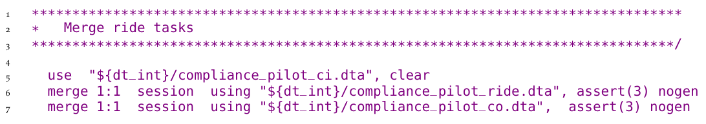
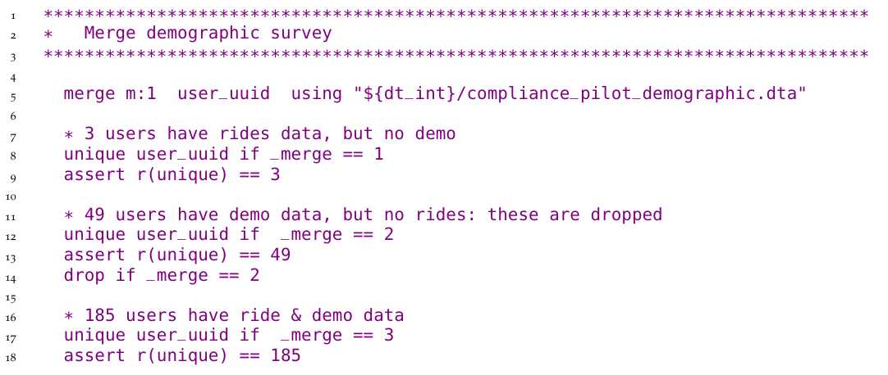
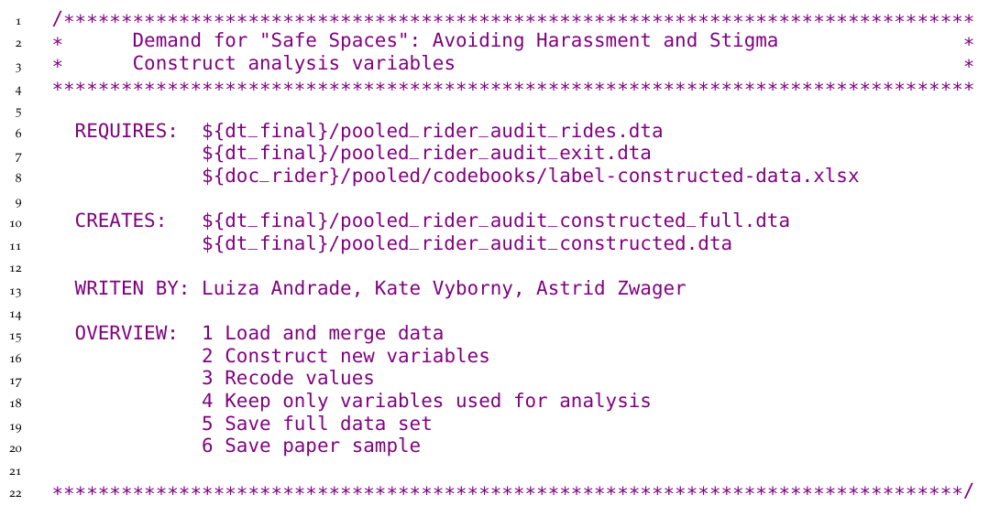
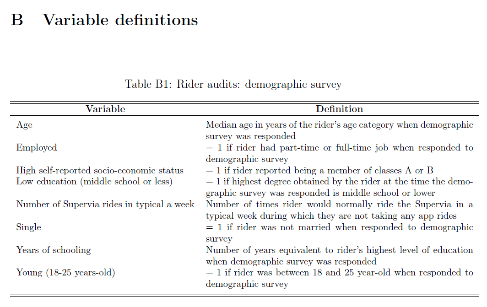
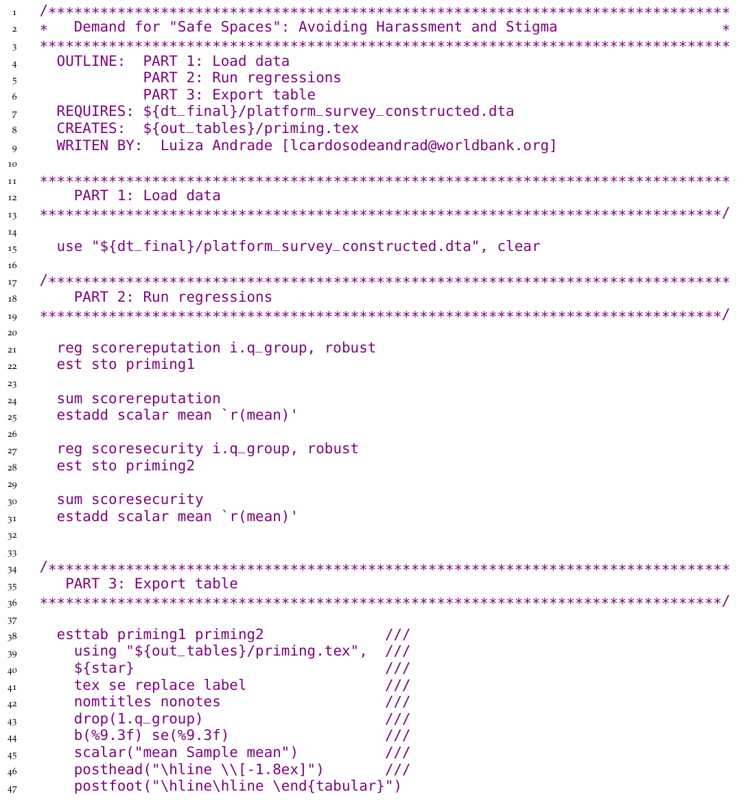
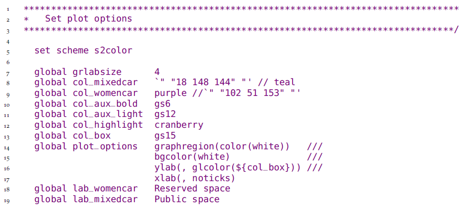
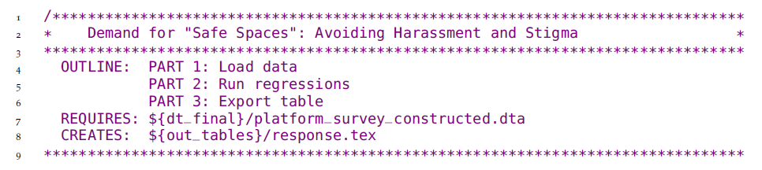
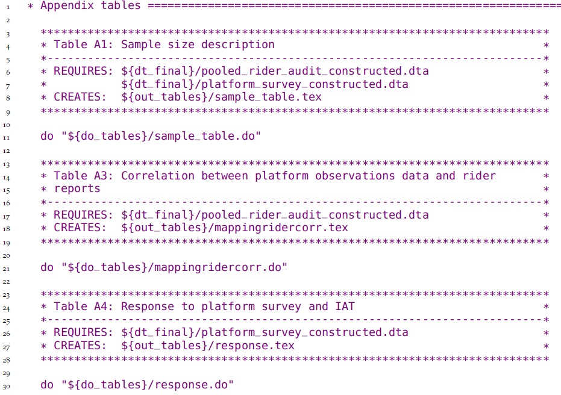

# Constructing and analyzing research data {#analysis}

 <!-- Motivation -->
The process of data analysis is typically
a back-and-forth discussion between people
with differing skill sets.
To effectively do this in a team environment,
data, code and outputs must be well-organized and documented,
with a clear system for version control,
analysis scripts that can be run by all team members,
and creation of research outputs fully automated.
Putting in time upfront to structure the data analysis workflow
in a reproducible manner pays substantial dividends throughout the process.
Similarly, documenting research decisions made during data analysis
is essential not only for research quality and transparency,
but also for the smooth implementation of a project.

 <!-- Chapter overview -->
In this chapter, we discuss the necessary steps to transform
cleaned raw data into informative analysis outputs such as tables and figures.
The suggested workflow starts where the last chapter ended:
with the outputs of data cleaning.
The first section covers variable construction:
transforming the raw data into economically meaningful indicators.
The second section discusses the analysis code itself.
We do not offer instructions on how to conduct specific analyses,
as that is determined by research design,
and there are many excellent existing guides.
Rather, we discuss how to structure and document data analysis
that is easy to follow and understand,
for both the full research team members and research consumers.
The final section discusses ways to automate common outputs
so that your work is fully reproducible.

```{block2, type = 'summary'}
### Summary: Constructing and analyzing research data {-}

To move from raw development data to the final datasets used for analysis, you will almost certainly need to combine and transform variables into the relevant indicators and indices. These constructed variables will then be used to create analytical outputs, ideally using a dynamic document workflow. Construction and analysis involves:

**1.	Constructing variables and purpose-built datasets.** Transforming pure observed data points into abstract or aggregate variables, and analyzing them properly, requires guidance from theory and is unique to each type of study. However, it should always involve the following:
  
- Maintaining *separate construction and analysis scripts*, and putting the appropriate code in the corresponding script even if they are simultaneously edited and executed by the master script
- *Merging or otherwise combining data* from different sources or units of observation
- Creating *purpose-built analytical datasets*, naming and saving them appropriately, and using them for the corresponding analytical tasks, rather than building a single analytical dataset
- *Carefully documenting* each of these steps in plain and clear language, so that the rationale behind each research decision Is clear for any research consumer

**2.	Generating and exporting exploratory and final outputs.** Tables and figures are the most common types of analytical outputs. All outputs must be well-organized and fully replicable. When creating outputs, always:
  
- Name *exploratory outputs* descriptively, and store them in easily-viewed formats
- Store *final outputs* separately from exploratory outputs, and export using production-quality formats 
- *Version-control all code* required to produce all outputs from analysis data
- *Archive code* when analyses or outputs are not likely to be used, with documentation for later recovery

**3.	Set up an efficient workflow for outputs.** This means that:
  
- Exploratory analyses are *immediately accessible*, ideally created with dynamic documents, and can be re-generated with a single script execution
- *Code and outputs are version-controlled* so it is easy to track where changes are coming from
- Final figures, tables, and other code outputs are exported from the statistical software *fully formatted* and the *final document is updated in an automated manner*, so that no manual workflow is needed to recreate documents when changes are made

#### Takeaways {-}

**TTLs/PIs will:**
  
- Provide the theoretical framework for the analysis and supervise production of analytical datasets and outputs, reviewing statistical calculations and code functionality
- Approve the final list of analytical datasets and their accompanying documentation
- Provide rapid review and feedback for exploratory analyses 
- Advise on file format and design requirements for final outputs, including dynamic document structures 

**RAs will: **
  
- Implement variable construction and analytical processes through code
- Manage and document datasets in such a way that they are easily understood by other team members
- Flag ambiguities, concerns, or gaps in translation from theoretical framework to code
- Draft and organize exploratory outputs for rapid review by management
- Maintain release-ready code and output organization with version control, so current versions of outputs are always accessible and final outputs are easily extracted from unused materials

#### Key Resources {-}

- DIME's **Research Assistant Onboarding Course** includes technical sessions on best practices for data construction ( https://osf.io/k4tr6/) and analysis (https://osf.io/82t5e/)
- **Visual libraries**: nice-looking, reproducible graphs in an easily browsable format. 
  - Stata visual library: https://worldbank.github.io/stata-visual-library. 
  - R econ visual library: https://worldbank.github.io/r-econ-visual-library
- The blogpost **Nice and fast tables in Stata?** discusses best practices and links to code demonstrations of how to export tables from Stata https://blogs.worldbank.org/impactevaluations/nice-and-fast-tables-stata 

```

<!-- ------------------------------------------------ -->

## Creating analysis datasets {-}

<!-- What is construction -->
For this chapter, we assume you are starting from
one or multiple well-documented tidy^[@hadley2017R] datasets.
We also assume that these datasets
have gone through thorough quality checks
and incorporate any corrections needed.^[
	See Chapter \@ref(processing) for discussions on how to
	tidy data, monitor data quality and document corrections.
]
The next step is to **construct**^[
	**Data construction**:
	The process of transforming cleaned data into analysis data by
	creating the derived indicators that will be analyzed.
]
the variables that you will use for analysis;
that is, to transform the cleaned data into analysis-ready data.
It's possible the data is ready for analysis as acquired,
but in most cases it needs to be prepared by integrating different datasets
and creating derived variables
(dummies, indices, and interactions, to name a few^[
  See @adjognon2019reducing for an example.
]
).
The derived indicators you will construct should be
planned during research design\index{research design},
with the pre-analysis plan serving as a guide.\index{pre-analysis plan}
During construction, data will typically be
reshaped, merged, and aggregated to change the level of the data points
from the **unit of *observation* ** in the raw data
to the **unit of *analysis* **.^[
	More details on the concepts of unit of observations
	and unit of analysis
	can be found on the DIME Wiki:
	https://dimewiki.worldbank.org/Unit_of_Observation
]
\index{unit of observation}\index{unit of analysis}

 <!-- A project may require multiple purpose-built data sets -->
Each analysis dataset is built to answer an analysis question.
If the sub-samples and units of observation
vary for different pieces of the analysis,
you will probably need to create many purpose-built analysis datasets.\index{analysis datasets}
In such cases, it is not good practice
to try to create a single "one-size-fits-all" analysis dataset.
For a concrete example of what this means,
think of an agricultural intervention
that was randomized across villages
and only affected certain plots within each village.
The research team may want to
run household-level regressions on income,
test for plot-level productivity gains,
and check if village characteristics are balanced.
Having three separate datasets for each of these three pieces of analysis
will result in cleaner, more efficient, and less error-prone analytical code than if
you started from a single analysis dataset and repeatedly transformed it.

### Organizing data analysis workflows  {-}

<!-- Why construction is separate from data cleaning -->
Construction follows data cleaning and
should be treated as a separate task for two reasons.
First, this helps to clearly differentiate error corrections
(necessary for all data uses)
from creation of analysis indicators
(necessary only for specific analyses).
Second, it helps to ensure that variable definitions are
consistent across datasets.
For example, take a project that has a baseline and an endline survey.
Unless the two data collection instruments are exactly the same,
which is preferable but often not the case,
the data cleaning for each of these rounds will require different steps,
and therefore will be done separately.
However, the analysis indicators must be constructed in the exact same way,
so they are comparable.
To do this, you will require at least two separate cleaning scripts,
and a unified construction script.
Maintaining one construction script guarantees that you will not
accidentally make changes to an indicator from one round
while forgetting to update the other.

<!-- Why construction is separate from analysis -->
When we visualize the research workflow,
variable construction precedes data analysis,
as derivative variables need to be created before they are analyzed.
In practice, however, as you analyze the data,
it is often useful to revisit construction,
and explore different subsets and transformations of the data.
Even if construction and analysis are done concurrently,
you should always code them in separate scripts.
If every script that creates a table starts by loading a dataset,
subsetting it, and manipulating variables,
any edits to construction need to be replicated in all scripts.
This increases the chances that at least one of them
will have a different sample or variable definition.
Coding all variable construction and data transformation
in a unified script, separate from the analysis code,
prevents such problems and ensures consistency across different outputs.

### Integrating multiple data sources {-}

<!-- When merging is necessary and how to start thinking about it -->
To create the analysis dataset,
it is typically necessary to combine information
from different data sources
or different datasets with a common source.
For the next few paragraphs,
we call such operations "merges",
but they are also commonly referred to as "data joins".
As discussed in Chapter \@ref(measurement),
this process should be documented
using **data flowcharts**,^[
	More details on DIME's data flow chart template
	and an example can be found on the DIME Wiki:
	https://dimewiki.worldbank.org/Data_Flow_Charts
]
and different data sources should only be combined
in accordance with the data linkage table.^[
	More details on DIME's data linkage table template
	and an example can be found on the DIME Wiki:
	https://dimewiki.worldbank.org/Data_Linkage_Table
]
For example, you may merge administrative data with survey data
in order to include demographic information in your analysis,
or you may want to integrate geographic information
in order to include location-specific controls.
To understand how to perform such operations,
you will need to consider the unit of observation for each dataset,
and their respective identifying variables.
Merges are frequent and complex operations,
which makes them a common source of error.
Whichever statistical software you are using,
take the time to read through the help file of merge commands
and make sure you understand their options and outputs.\index{merging data}

<!-- How to think about merges -->
When writing the code to implement merge operations,
a few steps can help avoid mistakes.
First, before writing code to combine the datasets,
write pseudocode to understand which observations you expect to be
matched or not, and why.
When possible, determine exactly which and how many
matched and unmatched observations should result from the merge.
The best tool you have to understand this is
the three components of the data map discussed in Chapter \@ref(measurement).
Second, think carefully about whether you want to keep matched and unmatched observations,
or only specific matching outcomes (e.g. to create a balanced panel),
and add that to the pseudocode as well.
Finally, run the code to merge the datasets,
and compare the outcome to your expectations.
Add comments to explain any exceptions,
and make it so the code will return an error in case unexpected results show up in future runs.

<!-- Common mistakes -->
To avoid unintentional changes to your data,
pay close attention to merge results.
Two that require careful scrutiny are missing values and dropped observations.
Make sure to read about how each command treats missing observations:
are unmatched observations dropped, or are they kept with missing values?
Whenever possible, add automated checks in the script that throw an error message
if the result is different than what you expect,
or you may not notice changes in the outcome after running large chunks of code.
Document changes to the number of observations in your comments,
and explain why they are happening.
If your are subsetting your data by keeping only matched observations,
write down the reason why the observations differ across datasets,
as well as why you are only interested in those that matched.
The same applies when you are adding new observations from the merged dataset.

<!-- Data integration -->
Some merges of data with different units of observation
are more conceptually complex.
Examples include: overlaying road location data with household data,
using a spatial match; combining school administrative data, such as attendance records and test scores,
with student demographic characteristics from a survey;
or linking a dataset of infrastructure access points, such as water pumps or schools,
with a dataset of household locations.
In these cases, a key part of the research contribution is figuring out
a useful way to combine the datasets.
Since the conceptual constructs that link observations from the two data sources
are important and can take many possible forms,
it is especially important for the data integration to not be treated mechanically,
and to be extensively documented, separately from other data construction tasks.

```{block2, type = 'ex'}
### Demand for Safe Spaces Case study: Integrating Multiple Data Sources

The raw crowsourced data acquired for the *Demand for Safe Spaces* study was received by the research team in a different level of observation than the one relevant for analysis. The unit of analysis is a ride, and each ride was represented in the raw data by three rows, one for questions answered before boarding the train, one for those answered during the trip and one for those answered after leaving the train. The *Tidying raw data* example explains how the team created three different intermediate datasets for each of these tasks. To create the complete ride-level dataset, the team combined the individual task datasets. The code below shows how the team assured that all observations had merged as expected. Two different approaches depending on what you expect are shown.

The first code chunk shows the quality assurance protocol for when the team expected that all observations would exist in all datasets so that each merge would have only matched observations. To test that this was the case the team used the option `assert(3)`. When two dataset are merged in Stata each observations get the code 1, 2 or 3. 1 means that the observation only existed in the dataset in memory (called the "master data"), 2 means that the observation existed only in the other dataset (called the “using data”) and 3 means that they existed in both. `assert(3)` tests that all observation existed in both dataset and was coded as 3.



When merging observations that do not match perfectly, the quality assurance protocol requires that the RA document the reasons. The 1, 2, 3 merge result code explained above is saved in a variable named `_merge`. The *Demand for Safe Space* team used this variable to count the number of user IDs in each group and used the command assert to throw an error if the number of observations in any of the categories was changing, ensuring that the outcome is stable when the code is run multiple times.



> See the full script at https://git.io/JtgYf 

```

### Creating analysis variables {-}

<!-- Main points to keep in mind for new variables -->
Once you have assembled variables from different sources into a single working dataset
with the right raw information and observations,
it's time to create the derived indicators of interest for analysis.\index{analysis variables}
Before constructing new indicators,
you must check and double-check units, scales, and value assignments of each variable that will be used.
This is when you will use the knowledge
of the data and the documentation developed during cleaning the most.
First, check that all categorical variables have the same value assignment,
such that labels and levels have the same correspondence across variables that use the same options.
For example, it's possible that in one question `0` means "no" and `1` means "yes",
while in another one the same answers were coded as `1` and `2`.\index{binary variables}
(We recommend coding binary questions as either `1` and `0` or `TRUE` and `FALSE`,
so they can be used numerically as frequencies in means and as dummies in regressions.
This often implies re-expressing categorical variables like `gender` as binary variables like `woman`.)
Second, make sure that any numeric variables you are comparing
are converted to the same scale or unit of measure:
you cannot add one hectare and two acres and get a meaningful number.
New variables should be assigned functional names,
and the dataset ordered such that related variables are together.
Adding notes to each variable will make your dataset more user-friendly.

<!-- Dealing with outliers and missing values -->
At this point, you will also need to decide
how to handle any outliers or unusual values identified during data cleaning.
How to treat outliers is a research question.^[
  For more details on how to deal with outliers
  see the DIME Wiki:
  https://dimewiki.worldbank.org/Variable_Construction\#Dealing_with_outliers
]\index{outliers}
There are multiple possible approaches,
and the best choice for a particular case
will depend on the objectives of the analysis.
Whatever your team decides, make sure to explicitly note
what the decision was and how it was made.
Results can be sensitive to the treatment of outliers,
so keeping the original variable in the dataset
will allow you to test how much it affects your outputs.
All these points also apply to imputation of missing values and other distributional patterns.
As a general rule, never overwrite or delete original data during the construction process.
Always create derived indicators with new names.

<!-- Dealing with different levels of observation -->
Two features of data create additional complexities when constructing indicators:
research designs comprising multiple units of observation and analysis,
and designs with repeated observations of the same units over time.
When your research involves different units of observation,
creating analysis datasets will probably mean combining variables measured at these different levels.
If you followed our recommendations from Chapter \@ref(processing),
this means combining variables that are included in different tidy datasets.
To make sure constructed variables are consistent across datasets,
we recommend that each indicator be constructed in the dataset corresponding to its unit of observation.
Once we have indicators at each unit of observation,
they may be aggregated and/or merged to different units of analysis.
Take the example of a project that acquired data at both the student and teacher levels.
You may want to analyze the performance of students on a test
while controlling for teacher characteristics.
This can be done by assigning the teacher-level indicators to all the students in the corresponding class.
Conversely, you may want to include average student test scores
in the analysis dataset containing teacher-level variables.
To do so, you would start from the constructed dataset at student level,
average (using commands like `collapse` in Stata and `summarise` in R)
the test scores of all students taught by the same teacher,
and merge this teacher-level aggregate measure onto the original teacher dataset.
You should be mindful of two aspects while performing such operations:
the first is the correspondence between identifying variables at different levels,
which should be documented in the **data linkage table**;
the second is that they will necessarily involve merges,
so all the steps outlined in the previous section should be applied.

<!-- Maintaining indicator definition across rounds -->
Finally, creating a panel with survey data involves additional timing complexities.
It is common to construct indicators soon after receiving data from a new survey round.
However, creating indicators for each round separately increases the risk of using different definitions each time.
Having a well-established definition for each constructed variable helps prevent that mistake,
but the best way to guarantee it won't happen is to create the indicators for all rounds in the same script.
Say you constructed some analysis variables after baseline, and are now receiving midline data.
Then the first thing you should do is create a cleaned panel dataset,
ignoring the previous constructed version of the baseline data.
Our team created `iefieldkit`'s `iecodebook append` subcommand
to help you reconcile and append data from cleaned survey rounds
or similar data collected from different contexts.^[
  Read more about how to install and use `iecodebook` and
  how the command can help appending data more efficiently
  on the DIME Wiki:
  https://dimewiki.worldbank.org/iecodebook
]
\index{iefieldkit}\index{iecodebook}
This is done by completing an Excel sheet to indicate what changes in
names, value assignments, and value labels should be made so the data is consistent across rounds or settings.^[
  See @daniels2017use for an example.
]
By doing so, you are also creating helpful documentation about your data work.
Once data tables are consistently appended,
adapt your construction script so it can be used on the complete panel dataset.
In addition to preventing inconsistencies and documenting your work,
this process will also save you time and give you an opportunity to review your original code.

```{block2, type = 'ex'}
### Demand for Safe Spaces Case Study: Creating Analysis Variables

The header of the script that creates analysis variables for the crowdsourced data in the *Demand for Safe Spaces* study is shown below. Note that it starts from a pooled dataset that combines all waves of data collection. It is important that the variable construction is done after all waves have been pooled to make sure that all variables are constructed identically across all waves.
 


> See the full construction script here https://git.io/JtgY5 and the script where data from all waves are pooled here: https://git.io/JtgYA.

```

### Documenting variable construction {-}

<!-- Why documentation is important: transparency and reproducibility -->
Because data construction involves translating concrete observed data points
to measures of abstract concepts,
it is important to document exactly how each variable is derived or calculated.
Careful documentation is closely linked to the research principles discussed in Chapter \@ref(reproducibility).
It makes research decisions transparent,
as anyone can read about how you defined each variable in your analysis,
and what was the reasoning behind these decisions.
By reading the documentation,
someone unfamiliar with the project should be able to understand the contents of the analysis datasets,
the steps taken to create them, and the decision-making process through your documentation.
Ideally, they should also be able reproduce your steps and recreate the constructed variables.
Therefore, documentation is an output of construction as relevant as the code and data,
and it is good practice for papers to have an accompanying data appendix
listing analysis variables and their definitions.

<!-- How to document construction -->
The development of construction documentation is a good opportunity to have
a wider discussion with your team about creating protocols for variable definition,
which will guarantee that indicators are defined consistently across projects.
You must have a detailed account of how variables are created.
This will be implemented in your code, but you should still
add comments explaining in human language what you are doing and why.
This is a crucial step both to prevent mistakes and to guarantee transparency.
To make sure that these comments can be more easily navigated,
it is wise to start writing a variable dictionary as soon as you begin making changes to the data.^[
	See @jones2019factor for an example.
]
The variable dictionary can be saved in an Excel spreadsheet,
a Word document, or even a plain text file.
Whatever format it takes,
it should carefully record how specific variables have been combined, recoded, and scaled.
Whenever relevant, the code should point to these files to indicate
where the definition are being implemented.

<!-- iecodebook export -->
The `iecodebook export` subcommand is
a good way to ensure you have easy-to-read documentation.
When all your final indicators have been created,
you can use it to list all variables in the dataset in an Excel sheet.
You can then add the variable definitions to that file to create a concise metadata document.
Take this opportunity to review your notes and make sure that your code
is implementing exactly what is described in the documentation.

```{block2, type = 'ex'}
### Demand for Safe Spaces Case Study: Documenting Variable Construction

The *Demand for Safe Spaces* team documented the definition of every variable used to produce the outputs presented in the paper in an Appendix to the Working Paper. Appendix B includes a set of tables with variable definitions in non-technical language. The tables include variables collected through surveys, variables constructed for analysis, and research variables assigned by random processes.

 
 
> The full set of tables can be found on Appendix B of the Working Paper: https://openknowledge.worldbank.org/handle/10986/33853


```

<!-- ------------------------------------------------ -->

## Writing analysis code {-}

<!-- Intro: this section focuses on data analysis CODE -->
After data is cleaned and indicators are constructed, you are ready to start analyzing the data.
\index{data analysis}
There are many existing resources for data analysis and statistical methods, such as
*R for Data Science*;^[
  @hadley2017R
] 
*A Practical Introduction to Stata*;^[
  @RePEc:gdm:wpaper:9412
] 
*Mostly Harmless Econometrics*;^[
  @angrist2008mostly
] 
and *Causal Inference: The Mixtape*.^[
  @cunningham2018causal
] 
We focus on how to structure data analysis code and files, rather than how to conduct specific analyses.

```{block2, type = 'ex'}
###  Demand for Safe Spaces Case Study: Writing Data Analysis Code

The *Demand for Safe Spaces* team's analysis scripts are split into one script per output and the constructed data is re-loaded before each output. This ensures that final exhibit can be independently generated from the constructed data. No variable construction is done in the analysis scripts: the only data transformations performed are sub-setting the data or aggregating to a higher unit of observation. This guarantees that the same data is used across all analysis scripts. For an example of a short analysis do-file, see the code chunk below. 



> See this script and how the regression results were exported to a table at https://git.io/JtgOk.

```

### Organizing analysis code {-}

<!-- Exploratory vs final data analysis -->
The analysis stage usually starts with a process we call **exploratory data analysis**.\index{exploratory data analysis}
This is when you are first looking for patterns in your data,
creating descriptive graphs and tables,
and trying different tests to understand your results.
It progresses into **final analysis** when your team starts to decide which are the "main results",
or those that will make it into a research output.
The way you deal with code and code outputs for exploratory and final analysis is different.
During the exploratory stage,
you will be tempted to write lots of analysis into one big, impressive, start-to-finish script.
While this is fine when you are writing your research stream of consciousness into code,
it leads to poor practices in the final code such as not clearing the workspace
and not loading a fresh dataset before each analysis task.

<!-- Write independent analysis scripts -->
To avoid mistakes, it's important to take the time
to organize the code that you want to keep, that is,
the final analysis code, in an organized manner.
The result is a curated set of polished scripts that
will be part of a reproducibility package.\index{reproducibility package}
A well-organized analysis script starts with a completely fresh workspace
and, for each output it creates, explicitly loads data before analyzing it.
This setup encourages data manipulation to be done earlier in the workflow
(that is, in separate cleaning and construction scripts).
It also prevents the common problem of having analysis scripts
that depend on other analysis scripts being run before them.
Such dependencies tend to require manual instructions
for all necessary chunks of code to be run in the right order.
We encourage you to code each task so
it is completely independent of all other code,
except for the master script.
You can go as far as coding every output in a separate script,
but the key is making sure you know which datasets are used for each output,
and which code chunks implement each piece of analysis.

<!-- Writing easy to read analysis code -->
There is nothing wrong with code files being short and simple.
In fact, analysis scripts should be as simple as possible,
so whoever is reading them can focus on the concepts, not the coding.
Research questions and statistical decisions should be incorporated explicitly in the code through comments,
and their implementation should be easy to detect from the way the code is written.
This includes clustering, sampling, and controlling for different variables, to name a few.
If you have multiple analysis datasets,
each of their names should be descriptive of the sample and unit of observation they contain.
As your team comes to a decision about model specification,
you can create functions and globals (or objects) in the master script to use across scripts.
This is a good way to make sure specifications are consistent throughout the analysis.
It also makes your code more dynamic,
as it's easy to update specifications and results
through a master file without changing every script.

<!-- Naming analysis code -->
To create this setup,
you will need to make sure that you have an effective data management system,
including file naming, organization, and version control.
Just as for the analysis datasets,
you should name each of the individual analysis files descriptively.
Code files such as `spatial-diff-in-diff.do`,
`matching-villages.R`, and `summary-statistics.py`
are clear indicators of what each file is doing, and allow you to find code quickly.
If you intend to numerically order the script files
to correspond to exhibits as they appear in a paper or report,
leave this to near publication time,
as you will constantly re-order them during data analysis.

```{block2, type = 'ex'}
### Demand for Safe Spaces Cse Study: Organizing Analysis Code

The *Demand for Safe Spaces* team defined the control variables in globals in the master analysis script. This guaranteed that control variables were used consistently across regressions. It also provided an easy way to update control variables consistently across all regressions when needed. In an analysis script a regression that includes all demographic controls would then be expressed as `regress x y ${demographics}`.
 


> The above code is excerpted from the full master script, which you can find at https://git.io/JtgeT.

``` 

### Visualizing data {-}

<!-- Useful resources for data visualization -->
**Data visualization** is increasingly popular,
and is becoming a field in its own right.^[@healy2018data,wilke2019fundamentals]
Although the same principles for coding exploratory and final data analysis apply to visualizations,
creating them is usually more difficult than running a regression and exporting its results into a table.
We attribute some of the difficulty of creating good data visualization
to the difficulty of writing code to create them.
The amount of customization necessary to create a nice graph can lead the relevant commands to become quite intricate.
Making a visually compelling graph would already be hard enough if
you didn't have to go through many rounds of searching and reading help files
to understand a command's graphical options syntax.
Although getting each specific element of a graph to look exactly the way you want can be hard,
the solution to such problems is usually a single well-written search away,
and we recommend you leave these details as the very last adjustments to make.
In our experience, the trickiest part of using plotting commands is getting the data into the right format.
Though both Stata and R have plotting functions that graph summary statistics,
a good rule of thumb is to ensure that each
observation in your dataset corresponds to one data point in your desired visualization.
This may seem simple,
but often requires the aggregation and reshaping operations
discussed earlier in this chapter.

<!-- Stata Visual Library and ietoolkit -->
Based on DIME's accumulated experience creating visualizations for impact evaluations,
our team has developed a few resources to facilitate this workflow.
First of all, we maintain easily-searchable data visualization libraries for both Stata^[
	https://worldbank.github.io/Stata-IE-Visual-Library
] and R.^[
	https://worldbank.github.io/r-econ-visual-library/
]
These libraries feature curated data visualization examples, along with source code and example datasets,
so you get a good sense of what your data should look like
before you can start writing code to create a visualization.^[
	More tools and links to other resources for creating good data visualizations
	can be found on the DIME Wiki:
  https://dimewiki.worldbank.org/Data_visualization
]\index{data visualization}
The `ietoolkit` package also contains two commands to automate
common impact evaluation graphs:
`iegraph`^[
  Read more about how to install and use `iegraph` and
	how the command can be used to easily create graphs
	for two very common impact evaluation regressions
	on the DIME Wiki:
	https://dimewiki.worldbank.org/Iegraph
]
plots the values of coefficients for treatment dummies,
and `iekdensity` displays the distribution of an outcome variable
across groups and adds the treatment effect as a note.

```{block2, type = 'ex'}
### Demand for Safe Spaces Case Study: Visualizing Data

The Demand for Safe Spaces team defined the settings for graphs in globals in the master analysis script. This is a simple way to create a uniform visual style for all graphs produced by the project. These globals can then be used across the project when creating graphs like this:
  
`twoway  (bar cum x, color(${col_aux_light})) (lpoly y x, color(${col_1})) (lpoly z x, color(${col_2})),   ${plot_options}`


 
> The complete script is available at https://git.io/JtgeT.

```

<!-- ------------------------------------------------------------------------- -->

## Creating reproducible tables and graphs {-}

<!-- Intro: why to think about outputs ahead of time -->
A great number of outputs will be created during the course of a project.
These will include both raw outputs such as tables and graphs
and final products such as presentations, papers and reports.
During exploratory analysis, your team will consider different approaches
to answer research questions and present answers.
Though it is best to be transparent about different
specifications tried and tests performed,
only a few will ultimately be considered "main results".
These will be **exported**^[
  **Exporting results:** The creation of publication-ready representations of results.
]\index{exporting results}
from the statistical software.
That is, they will be saved as tables and figures in format that is easier to interact with.
For example, saving graphs as images will allow your team to quickly see them,
as well as to add them as exhibits to other documents.
When the first of these code outputs are being created, agree on where to store them,
what software and formats to use, and how to keep track of them.
This discussion will save you time and efforts on two fronts:
you will spend less time formatting and polishing tables and graphs that
will not make their way into final research products;
and you will remember the different paths your team has already
taken, so you don't do the same thing twice.
This section will take you through key elements to keep in mind
when making workflow decisions and outputting results.

### Managing outputs {-}

<!-- Where to store outputs -->
Decisions about storage of outputs are limited by technical constraints,
and dependent on file format.
Plain text formats like `.tex` and `.csv`
and should be managed through version control systems like Git,
as discussed in Chapter \@ref(collaboration).
Binary outputs like Excel files, PDFs, PowerPoints, or Word documents,
on the other hand, should be kept in a synced folder.
Exporting all raw outputs as plain text files,
which can be done through all statistical software,
facilitates the identification of changes in results.
When you re-run your code from the master script,
the outputs will be overwritten,
and any changes (for example, in coefficients or number of observations)
will be automatically flagged for you or a reviewer to check.
Tracking changes to binary files is more cumbersome.
They they use more space,
which may cause slow down the cloud syncing.
There may be exceptions to this general rule
depending on the Git client you are using.
GitHub Desktop, for example,
displays changes in common binary image formats such as PNG files
in an accessible manner.

<!-- Tracking scripts and their outputs -->
You will need to update your outputs frequently.
And if you have tried to recreate a result after a few months,
you probably know that it can be hard to remember where the code that created it was saved.
File naming conventions and code organization,
including easily searchable file names and comments,
play a key role in not re-writing scripts again and again.
We recommend maintaining one "final" analysis folder
and one folder with draft code or exploratory analysis.
The latter contains pieces of code that are stored for reference,
but not cleaned up to be included in any final outputs.
Once an output presents a result in the clearest manner possible,
it should be renamed and moved to the "final analysis" folder.
It's typically desirable to have the names of outputs and scripts linked --
so, for example, `factor-analysis.do` creates `factor-analysis.eps` and so on.
Document output creation in the master script that runs your code,
so that before the line that runs a particular analysis script
there are a few lines of comments listing
datasets and functions that are necessary for it to run,
as well as all outputs created by that script.

<!-- File formats -->
Knowing how your code outputs will be used will help you decide the best format to export them.
You can often save figures into different formats,
such as `.eps`, `.png`, `.pdf` or `.jpg`.
However, the decision between using Office Suite software such as Word and Power Point
versus LaTeX and other plain text formats may influence how you write your code,
as this choice often implicates in the use of a particular command.
We strongly recommend that you chose software to create final products
that can be linked to raw outputs in such a way that they are updated
in the paper or presentation every time changes are made to them.
We broadly call files that have this feature **dynamic documents**,\index{dynamic documents}
and they will be discussed in more detail in the final section of this chapter.

```{block2, type = 'ex'}
### Demand for Safe Spaces Case Study: Managing Outputs

It is important to document which datasets are required as inputs in each script, and what datasets or files are created by each script. The *Demand for Safe Spaces* team documented this both in the header of each script but also in a comment in the master do-file where the script was called.

This is a header of an analysis script called response.do that requires the file `platform_survey_constructed.dta` and generates the file `response.tex`. Having  this information on the header allows people reading the code to check that they have access to all the necessary files before trying to run a script.



To provide the people who are interacting with the code with an overview of what are the different subscript involved in a project, this information was copied into the master do-file where the script above is called, and the same is done for all the script called from that master, as shown below. 



> You can find this analysis script at https://git.io/JtgYB and the master do-file at https://git.io/JtgY6.

```

### Exporting analysis outputs {-}

<!-- Which outputs should be fully automated and why -->
As briefly discussed in the previous section,
you do not necessarily have to export each and every table and graph
created during exploratory analysis.
Most statistical software allow you to review results interactively,
and this is often preferred at this stage.
Final analysis scripts, on the other hand, must export outputs
that are ready to be included in a paper or report.
No manual edits, including formatting,
should be necessary after exporting final outputs.
Manual edits are difficult to reproduce;
the less you need them, the more reproducible your output is.
You may think that it's not worth coding a small formatting adjustment,
but you will inevitably need to make changes to the output,
and automating them will save you time by the end of the process.
(However, don't spend much time formatting tables and graphs until
you have come to a decision about which will be used for your final product.^[
	For a more detailed discussion on this, including different ways to export tables from Stata,
	see https://blogs.worldbank.org/impactevaluations/nice-and-fast-tables-stata
]
)
Polishing final outputs can be a time-consuming process,
and you want to do it as few times as possible.

<!-- Don't copy-paste!! -->
We cannot stress this enough:
do not set up a workflow that requires copying and pasting results.
Copying results from Excel to Word is error-prone and inefficient.
Copying results from a software console is risk-prone,
even more inefficient, and totally unnecessary.
The amount of work needed in a copy-paste workflow increases
rapidly with the number of tables and figures included in a research output,
and so do the chances of having the wrong version of a result in a paper or report.

<!-- Output formats -->
There are numerous commands to export outputs from both R and Stata.
Some examples are `estout`,^[
  @estout05, @estout07
]
`outreg2`,^[
  @wada2014outreg2
]
and `outwrite`^[
  @daniels2019outwrite
] in Stata;
and `stargazer`^[
  @hlavac2015stargazer
],
`huxtable`,
and `ggplot2`'s `ggsave`^[
  @ggplot2
] 
in R.
They allow for a wide variety of output formats.
We recommend using formats that are accessible and, whenever possible, lightweight.
Accessible means that it's easy for other people to open them.
In Stata, that would mean always using `graph export` to save images as
`.jpg`, `.png`, `.pdf`, etc.,
instead of `graph save`,
which creates a `.gph` file that can only be opened by Stata.
Some publications require "lossless" TIFF or EPS files,
which are created by specifying the desired extension.
Whichever format you decide to use,
remember to always specify the file extension explicitly.
For tables, there are fewer file format options.
Given our recommendation to use **dynamic documents**,\index{dynamic documents}
which will be discussed in more detail both in the next section and in Chapter \@ref(publication),
exporting tables to `.tex` is preferred.
Excel `.xlsx` and `.csv` are also commonly used,
but often require the extra step of copying the tables into the final output.
The `ietoolkit` package includes two commands to export formatted tables,
automating the creation of common outputs and saving time for research.\index{ietoolkit}
`iebaltab` creates and exports balance tables to Excel or LaTeX.^[
	Read more about how to install and use `iebaltab`
	and how it simplifies balance tables in Stata on the DIME Wiki:
  https://dimewiki.worldbank.org/iebaltab.
]\index{LaTeX}
`ieddtab` does the same for difference-in-differences regressions.^[
	Read more about how to install and use `ieddtab`
	and how it simplifies generating tables for difference-in-differences regressions
  in Stata on the DIME Wiki:
	https://dimewiki.worldbank.org/ieddtab.
]

<!-- Last touches: formatting tables and including meta data -->
If you need to create a table with a very specific format
that is not automated by any command you know, consider writing it manually
(Stata's `filewrite` and R's `cat()`, for example, allow you to do that).
This will allow you to write a cleaner script that focuses on the econometrics,
and not on complicated commands to create and append intermediate matrices.
Keep in mind that final outputs should be self-standing.
This means it should be easy to read and understand them with only the information they contain.
Make sure labels and notes cover all relevant information
included in your code and comments that are not otherwise visible in the output.
Examples of information that should be included in labels and notes include sample,
unit of observation, unit of measurement, and variable definition.^[
	A checklist with best practices important to remember
	to generate informative and easy to read tables
	can be found on the DIME Wiki:
	https://dimewiki.worldbank.org/Checklist:_Submit_Table.
]

## Increasing efficiency of analysis with dynamic documents {-}

<!-- Intro: what it is and why to use it -->
**Dynamic documents**^[
  **Dynamic documents:** File types that include direct references
  to exported materials and update them in the output automatically.
]\index{dynamic documents}
are a broad class of tools that enable a streamlined, reproducible workflow.
The term "dynamic" can refer to any document-creation technology
that allows the inclusion of explicitly encoded linkages to raw output files.
This means that, whenever outputs are updated,
the next time the document is loaded or compiled, it will automatically include
all changes made to all outputs without any additional intervention from the user.
This is not possible in tools like Microsoft Office,
although there are tools and add-ons that produce similar functionality.
In Word, by default, you have to copy and paste each object individually
whenever tables, graphs, or other inputs have to be updated.
This workflow becomes more complex as the number of inputs grows,
increasing the likelihood of making mistakes or missing updates.
Dynamic documents prevent this from happening by managing document compilation and
inclusion of inputs in a single integrated process,
so you can skip the copying and pasting altogether.

### Conducting dynamic exploratory analysis {-}

<!-- Markdown -->
If all team members working on a dynamic document are comfortable using the same statistical software,
built-in dynamic document engines are a good option for exploratory analysis.
With these tools,
you can write both text (often in Markdown^[
  https://www.markdownguide.org/
]) and code in the script,
and the result will usually be a PDF or HTML file including code, text, and outputs.
In our experience, many researchers find the entry cost to learning how to use these tools to be high.
These types of dynamic document tools are typically best used by the team members working most closely with code,
and can be great for creating exploratory analysis reports as you work on them,
or paper appendices including large chunks of code and dynamically created graphs and tables.
RMarkdown^[
  https://rmarkdown.rstudio.com
] 
is the most widely adopted solution in R.
Stata offers a built-in package for dynamic documents, `dyndoc`,^[
		https://www.stata.com/manuals/rptdyndoc.pdf
]
and user-written commands such as `markstat`,^[
  @pr0067
] 
`markdoc`,^[
  @pr0064
]  
`webdoc`,^[
  @pr0065
] 
and `texdoc`.^[
  @pr0062
] 
The advantage of these tools in comparison with LaTeX is that
they create full documents from within your scripts,
so running the code and compiling the document is reduced to a single step.

<!-- Non-code options -->
Documents called "notebooks"
(such as Jupyter Notebook^[
  https://jupyter.org
])
work similarly,
as they also use the underlying code that create the document.
These tools are usually appropriate for short or informal documents
because it tends to be difficult for those who are not familiar with them to edit the content,
and they often don't offer as extensive formatting options as, for example, Word.
There are also other simple tools for dynamic documents
that do not require direct operation of the underlying code or software,
simply access to the updated outputs.
An example of this is Dropbox Paper,
a free online writing tool that can be linked to files in Dropbox
which are automatically updated anytime the file is replaced.
These have limited functionality in terms of version control and formatting,
and may never include any references to confidential data,
but they do offer extensive collaboration features,
and can be useful for working on informal outputs.
Markdown files on GitHub can also provide similar functionality through the browser,
and are version controlled.
However, as with other Markdown options, the need to learn a new syntax may
discourage take up among team members who don't work with GitHub more extensively.

 <!-- Third best -->
Whatever software you are using,
what matters is that you make sure to implement a self-updating process for table and figures.
We have given a few recommendations as to what we believe to be best practices,
but you will need to find out what works for your team.
If your team has decided to use Microsoft Office, for example,
there are still a few options to avoid problems with copy-pasting.
The easiest solution may be for the less code-savvy members of the team
to develop the text of the final output pointing to exhibits that are not included inline.
If all figures and tables are presented at the end of the file,
whoever is developing the code can export them into a Word document using Markdown,
so at least this part of the file can be quickly updated when the results change.
Finally, statistical programming languages can now often directly export to these formats,
such as using the `putexcel` and `putdocx` commands in Stata, which can update or respect formatting in Office documents.^[
  See more details at
  https://www.stata.com/manuals/rptputexcel.pdf
  and https://www.stata.com/stata-news/news32-3/spotlight-putdocx/.
]

### Using LaTeX for dynamic research outputs {-}

<!-- What is LaTeX -->
Though formatted text software such as Word and PowerPoint are still prevalent,
researchers are increasingly choosing to prepare final outputs
like documents and presentations using LaTeX.\index{LaTeX}
LaTeX is a document preparation and typesetting system with a unique code syntax.^[
  See https://github.com/worldbank/DIME-LaTeX-Templates.
]
While LaTeX has a significant learning curve,
its enormous flexibility in terms of operation, collaboration, output formatting, and styling
make it our preferred choice for most large technical outputs.
In fact, LaTeX operates behind-the-scenes in many other dynamic document tools (discussed below).
Therefore, we recommend that you learn LaTeX as soon as you are able to.

<!-- Advantages of LaTeX -->
The main advantage of using LaTeX is that it updates outputs every time the document is compiled,
while still allowing for text to be added
and extensively formatted to publication-quality standards.
Additionally, because of its popularity in the academic community,
social scientists are more familiar with it than other dynamic documents tools,
so the cost of entry for a team is often relatively low.
Because `.tex` files are plain text,
they can be version-controlled using Git.
Creating documents in LaTeX using an integrated writing environment such as TeXstudio, TeXmaker or LyX
is great for outputs that focus mainly on text
and include figures and tables that may be updated.
It is good for adding small chunks of code into an output.
Finally, some journals make LaTeX templates available,
so papers can be more easily be formatted into their specific layout.

## Looking ahead {-}

This chapter discussed the steps needed to
create analysis datasets and outputs from original data.
By combining the observed variables of interest for the analysis (measurement variables)
with the information in the data map describing the study design (research variables),
you created original datasets ready for analysis,
as shown in the figure below.
Doing so is difficult, creative work,
and it is impossible to be reproduced by another person
without access to detailed records and explanations
of how you interpreted and modified the data.
You learned that code must be well-organized and well-documented
to allow others to understand how research outputs were created
and how those were used to answer the research questions.
The final chapter of this book will provide a guide
to assembling the raw findings into publishable work,
as well as describing methods for making your data,
code, documentation, and other research outputs
accessible and reusable alongside your primary outputs.

```{r, fig.cap = "Data analysis tasks and outputs", echo = FALSE}
knitr::include_graphics('img/Analysis.png')
```
