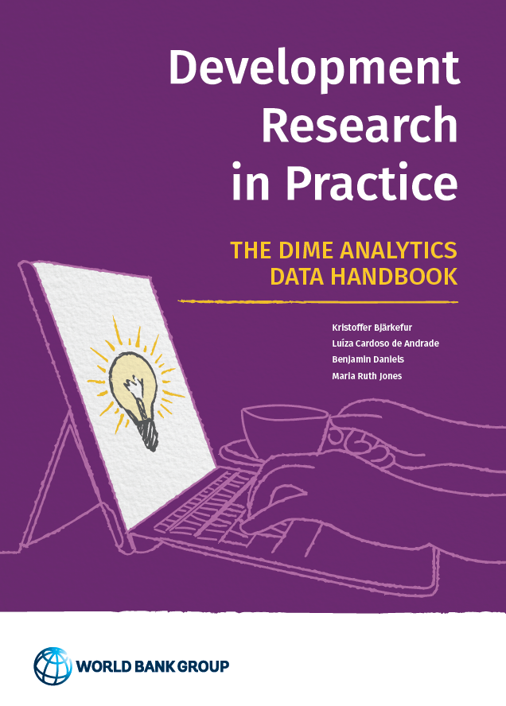

# Welcome {-}

---

::: {style="width: 55%; padding-right: 20px; float: left;"}

:::

### Published by   [DIME Analytics](https://www.worldbank.org/en/research/dime/data-and-analytics) {-}

This eBook is compiled directly from repository for this book. The current version was compiled from the following commit:
`r paste0('https://github.com/worldbank/dime-data-handbook/commit/', system("git rev-parse HEAD", intern=TRUE))`

The PDF version of the 2021 publication of this book can be found [here](https://hdl.handle.net/10986/35594).

Released under a [Creative Commons Attribution 4.0 International (CC BY 4.0)](https://creativecommons.org/licenses/by/4.0) license.
